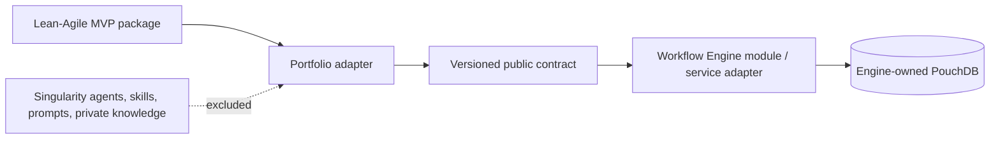

# ADR-001 — Workflow Engine Public Consumer Boundary

**Status:** Accepted

**Date:** 2026-08-19

**Deciders:** Dave Jackson

> 🔴 **Counterparty superseded 2026-09-08 by [ADR-002](adr-002-lean-agile-os-is-the-upstream-platform.md).**
> **The boundary below stands** — an independently versioned public contract, a thin
> methodology-neutral adapter, no source imports, no foreign datastore reads, and contract rules 1-6
> unchanged. **What changed is who provides it: `lean-agile-os`, not `singularity`.**
>
> ⚠️ **Read every "Singularity" below as "LeanAgileOS"**, including the *Acceptance evidence*
> requirement for a reciprocal provider-side ADR, which `lean-agile-os` now owes.
>
> ⚠️ **The code has not moved and still imports `@singularity/workflow-engine`.** `lean-agile-os`
> publishes no equivalent package, so the rename would break the build. ADR-002 §4 lists the six
> references — including the guard that enforces this very boundary — and the six missing symbols.

## Context

Portfolio is the first planned external consumer of the Singularity Workflow Engine. It needs the
engine to execute the Lean-Agile MVP extension, record approved macro evidence in
PouchDB, and later publish a user-scoped activity projection. A source import from Singularity, a
shared PouchDB database, or a copied implementation would make the public Portfolio repository
depend on an unversioned private boundary and risk publishing proprietary material.

The Workflow Engine plan already identifies its intended consumer shape: a programmatic Nest
module/factory whose consumers dispatch CQRS commands and queries. Its PouchDB repositories,
state documents, audit implementation, and changes-feed mechanics remain engine internals.

## Decision

Portfolio will integrate through Singularity's independently versioned
`@singularity/workflow-engine/public` package export. The contract will
expose commands, queries, documented JSON result/error envelopes, and approved versioned event
envelopes. Portfolio owns only its thin, methodology-neutral adapter. The independently versioned
Lean-Agile MVP package owns its extension definitions and can be consumed by any project; neither
package imports Singularity source paths or persistence internals.

The public-boundary decision is accepted. Runtime delivery remains gated on the matching
Singularity ADR, JSON Schema artifacts, compatibility fixture, and no-private-import test. This is
not authorization to read another service's PouchDB or build a Portfolio-owned clone of the
engine.

During coordinated local development, `npm run install:workflow-packages:local` packs the sibling
Workflow Engine and Lean-Agile MVP packages and installs those artifacts under Portfolio's
`node_modules`. It does not add cross-repository `file:` dependencies to the manifest or lockfile.
Registry installation remains the release-time distribution mechanism.

### Allowed dependency directions

### Contract rules

1. Commands and queries carry a contract version, workflow identity, correlation ID, and actor
   scope derived by the trusted server boundary.
2. Persisted/interoperable request, response, event, macro, and snapshot artifacts use checked-in
   JSON Schema as their reviewable source; TypeScript representations are derived or adapted.
3. Approved cross-service facts use `PlatformEventEnvelope` with stable event identity, type,
   version, organization scope, correlation ID, occurrence time, and allowlisted payload.
4. Event recordings are audit evidence only. Macro replay requires a separate immutable,
   human-approved command recipe and executes only against a disposable workspace.
5. Portfolio receives user activity only through a server-side projection filtered by derived
   `principalId` and `organizationId`; the browser cannot select either scope.
6. Docker images may contain only public baseline data or sanitized fixtures. Runtime recordings,
   keys, and decrypted stores are injected or mounted outside the image.

### VS Codium reference integration

The Workflow Engine's VS Codium extension and NestJS sidecar are a separate reference consumer of
this public contract. Portfolio neither imports nor distributes editor/sidecar implementation
paths. Portfolio receives a public programmatic client or a future hosted adapter with the same
versioned command/result/event envelopes.

## Consequences

### Positive

- Portfolio becomes meaningful second-consumer evidence without exposing private implementation.
- The contract can be compatibility-tested and later delivered as a package or service adapter
  based on evidence, rather than assumed extraction.
- PouchDB lifecycle, encryption, replication, and recovery remain one engine concern.

### Constraints

- Phase 01 cannot implement a production adapter until the contract version and schemas are
  accepted in both repositories.
- The two repositories must coordinate compatible changes, fixtures, and release notes.
- A direct import, datastore read, or ad-hoc event shape is a boundary violation and fails review.

## Acceptance evidence

- A reciprocal Singularity ADR accepts the provider-side boundary.
- JSON Schema artifacts define the first command/query/envelope/error surface.
- A Portfolio fixture compiles and runs against the public surface without importing a private
  Singularity package or path.
- Sanitized fixtures demonstrate redaction, idempotency, and actor/organization scope enforcement.

## References

- [Workflow Engine and Lean-Agile MVP Foundation feature plan](../planning/features/workflow-engine-lean-agile-mvp-foundation.feature.md)
- [Phase 00 checklist](../planning/features/workflow-engine-lean-agile-mvp-foundation/phases/00-charter-contract-freeze/checklist.md)
- [Portfolio architecture specification](portfolio-architecture-spec.md)
- Singularity ADR-088 — VS Codium Sidecar Reference Integration. 🔴 **Not ported to `lean-agile-os`**, and deliberately not redirected: no counterpart decision exists there ([ADR-002](adr-002-lean-agile-os-is-the-upstream-platform.md) §5). The absolute filesystem path this line used to carry resolved only in a local `singularity` checkout
