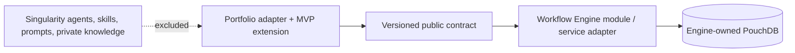

# ADR-001 — Workflow Engine Public Consumer Boundary

**Status:** Proposed

**Date:** 2026-08-19

**Deciders:** Dave Jackson

## Context

Portfolio is the first planned external consumer of the Singularity Workflow Engine. It needs the
engine to execute the Portfolio Lean-Agile MVP extension, record approved macro evidence in
PouchDB, and later publish a user-scoped activity projection. A source import from Singularity, a
shared PouchDB database, or a copied implementation would make the public Portfolio repository
depend on an unversioned private boundary and risk publishing proprietary material.

The Workflow Engine plan already identifies its intended consumer shape: a programmatic Nest
module/factory whose consumers dispatch CQRS commands and queries. Its PouchDB repositories,
state documents, audit implementation, and changes-feed mechanics remain engine internals.

## Decision

Portfolio will integrate through a versioned public Workflow Engine contract. The contract will
expose commands, queries, documented JSON result/error envelopes, and approved versioned event
envelopes. Portfolio will own a thin adapter and its Lean-Agile MVP extension definitions; it will
not import Singularity source paths or persistence internals.

The first contract version is not approved until the matching Singularity ADR, JSON Schema
artifacts, compatibility fixture, and no-private-import test are accepted. Until then this ADR is
a boundary proposal only—not authorization to publish a package, read another service's PouchDB,
or build a Portfolio-owned clone of the engine.

### Allowed dependency directions

### Contract rules

1. Commands and queries carry a contract version, workflow identity, correlation ID, and actor
   scope derived by the trusted server boundary.
2. Persisted/interoperable request, response, event, macro, and snapshot artifacts use checked-in
   JSON Schema as their reviewable source; TypeScript representations are derived or adapted.
3. Approved cross-service facts use `PlatformEventEnvelope` with stable event identity, type,
   version, organization scope, correlation ID, occurrence time, and allowlisted payload.
4. Event recordings are audit evidence only. Macro replay requires a separate immutable,
   human-approved command recipe and executes only against a disposable workspace.
5. Portfolio receives user activity only through a server-side projection filtered by derived
   `principalId` and `organizationId`; the browser cannot select either scope.
6. Docker images may contain only public baseline data or sanitized fixtures. Runtime recordings,
   keys, and decrypted stores are injected or mounted outside the image.

## Consequences

### Positive

- Portfolio becomes meaningful second-consumer evidence without exposing private implementation.
- The contract can be compatibility-tested and later delivered as a package or service adapter
  based on evidence, rather than assumed extraction.
- PouchDB lifecycle, encryption, replication, and recovery remain one engine concern.

### Constraints

- Phase 01 cannot implement a production adapter until the contract version and schemas are
  accepted in both repositories.
- The two repositories must coordinate compatible changes, fixtures, and release notes.
- A direct import, datastore read, or ad-hoc event shape is a boundary violation and fails review.

## Acceptance evidence

- A reciprocal Singularity ADR accepts the provider-side boundary.
- JSON Schema artifacts define the first command/query/envelope/error surface.
- A Portfolio fixture compiles and runs against the public surface without importing a private
  Singularity package or path.
- Sanitized fixtures demonstrate redaction, idempotency, and actor/organization scope enforcement.

## References

- [Workflow Engine and Lean-Agile MVP Foundation feature plan](../planning/features/workflow-engine-lean-agile-mvp-foundation.feature.md)
- [Phase 00 checklist](../planning/features/workflow-engine-lean-agile-mvp-foundation/phases/00-charter-contract-freeze/checklist.md)
- [Portfolio architecture specification](portfolio-architecture-spec.md)
