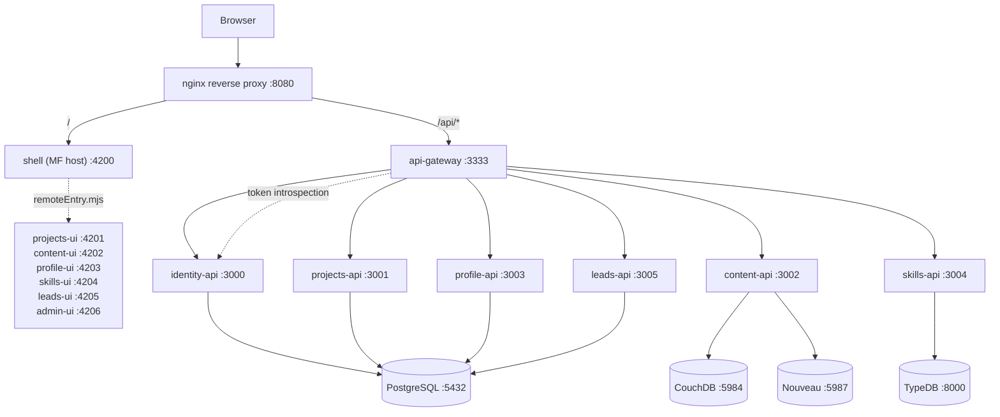

# Portfolio — Architecture Specification (Design Session v0.1)

**Status:** Draft — design session output, not yet ratified
**Date:** 2026-08-18
**Models after:** `lean-agile-os` (second workspace root)

> 🔴 **Upstream repointed 2026-09-08 — see [ADR-002](adr-002-lean-agile-os-is-the-upstream-platform.md).**
> Every reference in this document that said *Singularity* now says **LeanAgileOS**, which is the
> successor platform; `singularity` is maintenance-only.
>
> ⚠️ **Four references deliberately still say Singularity, and each says why.** They are the npm
> scope `@singularity/*` that exists in code (§11), and three artifacts that were never ported —
> **Phase 21**, the reciprocal extraction ADR, and `platform-vision.md`. A marked gap is auditable;
> a redirected one is indistinguishable from a decision that was actually taken.
>
> ⚠️ **The two cross-repository ADR citations were resolved by subject, not by number.** The
> repositories number independently and the same number means different decisions — ADR-002 §2 has
> the mapping.

---

## 1. Intent

Rebuild the Portfolio Nx workspace as a **federated Angular front end** and a set of **NestJS/CQRS
microservices** behind an **API Gateway**, fronted by an **nginx reverse proxy**, orchestrated with
**Docker Compose**, over **polyglot persistence** (PostgreSQL / CouchDB+Nouveau / TypeDB).

Architecture, tagging, layering, and governance follow LeanAgileOS's established patterns so that
lessons already paid for there are not re-learned here.

---

## 2. Decisions taken in this session

| # | Decision | Rationale |
|---|---|---|
| D1 | Seven bounded contexts: Identity, Projects, Content, Profile, Skills, Leads, Admin | Founder selection. Testimonials explicitly excluded from v1. |
| D2 | Polyglot persistence, mapped per context (§5) | Each store is chosen for a capability the others do the badly, not for variety. |
| D3 | Shell converts to **webpack Module Federation**; SSR is dropped | Matches LeanAgileOS. SSR + MF do not compose cleanly. See R1. |
| D4 | Full governance port: CLAUDE.md, ADRs, phase/checklist/summary + branch discipline, Cucumber/Screenplay gate, Session Start/Stop | Founder selection. |
| D5 | Production target undecided; design for Compose, keep the exit open | Constrains us to no Compose-only primitives at the app layer (§9). |
| D6 | **Admin/CMS is a UI remote with no microservice or datastore of its own** | It is an authoring surface. It composes each context's existing write API through the gateway. Giving it its own service would create a second write path to every aggregate. |
| D7 | **Module Federation is retained for demonstration value, not runtime efficiency** (resolves OQ5) | The portfolio's job is to evidence capability with MFEs. Cost-efficiency arguments against MF are therefore *out of scope* — but see the amended R1: the fallback is a different MF implementation, never "drop MF". |
| D8 | **The repository is public on GitHub. The source is a portfolio artefact in its own right.** | Changes the audience: reviewers read the repo, not just the site. Drives §10 (public-repo posture) and raises README, ADRs, commit hygiene, CI visibility, and security posture from housekeeping to deliverables. |
| D9 | **A third Nx monorepo `projects/platform` is the intended home for shared code** (OIDC, Workflow Engine, common domain/ui/infrastructure libs), published as artifacts and consumed by LeanAgileOS and Portfolio | Founder direction, 2026-08-18. **Accepted as direction, gated on evidence — see §11.** Not scheduled before Portfolio Phase 03. |
| ~~D10~~ | ~~Portfolio is the replacement for `davejackson.dev`; V1 amended.~~ | **Withdrawn 2026-08-18, same session, superseded by D11.** Retained as a record because it briefly reorganised this spec. |
| **D11** | **Portfolio is a separate product at `portfolio.davejackson.dev`, linked from `davejackson.dev`.** `davejackson.dev` stays in LeanAgileOS and is simplified by shedding its Portfolio/Case-Study duplication. | Founder proposal, 2026-08-18. **Recommended — see §12.** Strictly better than D10: no production cutover, no wholesale artifact migration, and V1 needs no amendment because it never bound a third product. |

---

## 3. Target repository layout

```
apps/
  platform/
    shell/              # Angular MF host          — scope:platform, type:app
    api-gateway/        # NestJS HTTP gateway      — scope:platform, type:app
  identity/
    ui/  api/           # scope:identity
  projects/
    ui/  api/           # scope:projects
  content/
    ui/  api/           # scope:content
  profile/
    ui/  api/           # scope:profile
  skills/
    ui/  api/           # scope:skills
  leads/
    ui/  api/           # scope:leads
  admin/
    ui/                 # scope:admin — remote only, no api (D6)

libs/
  shared/
    ui/                 # scope:shared, type:ui
    infrastructure/     # scope:shared, type:infrastructure
  <ctx>/
    domain/             # entities, VOs, domain events, repository PORTS — type:domain
    application/        # commands, queries, CQRS handlers, DTOs        — type:application
    infrastructure/     # repository impls, adapters                    — type:infrastructure
    feature-*/          # Angular feature libs                          — type:feature

infra/
  nginx/                # reverse-proxy conf
  postgres/             # init SQL
  couchdb/  nouveau/    # nouveau.ini, search index defs
  typedb/               # *.schema.typeql

docs/
  architecture/         # ADRs + this spec
  planning/             # feature docs, phase checklists/summaries
  standards/
features/               # Cucumber features + Screenplay step definitions
```

> **Migration of what exists today:** `apps/portfolio-web` → `apps/platform/shell`;
> `apps/api` → `apps/platform/api-gateway`; `apps/portfolio-web-e2e` → `apps/platform/shell-e2e`.
> `libs/` is currently empty — every lib below is new.

---

## 4. Bounded contexts

> 🔴 **These seven contexts were invented during the 2026-08-18 design session, before it emerged
> that Domain Storytelling (Workshop 4) and Architecture Design (Workshop 5) outputs already exist
> for the overlapping `davejackson.dev` product on `mvp/davejackson/01`.** Under **D11** only the
> Portfolio/Case-Study slice of that work transfers here — but it does transfer, and it was produced
> with the founder in the room. Treat §4 as a proposal to reconcile against those artifacts, not a
> ratified model. See §12.
>
> **Under D11, the Content context shrinks or disappears** — articles stay on `davejackson.dev`.
> See OQ10.

| Context | Owns | Does **not** own |
|---|---|---|
| **Identity** | Principals, credentials, sessions, OIDC tokens, roles/policy | Any profile/bio data — that's Profile |
| **Projects** | Case studies, tech stacks used, outcomes, media refs, publish state | The article text about a project — that's Content |
| **Content** | Articles, long-form copy, tags, full-text search index | Project metadata; author bio |
| **Profile** | Bio, experience, education, CV generation | Skill relationships — that's Skills |
| **Skills** | Skills, proficiency, and the *relations* between skills, projects, and roles | Skill descriptions rendered on a project page (read model, served via gateway composition) |
| **Leads** | Inbound enquiries, spam scoring, notification dispatch | Sending the email itself (adapter concern) |
| **Admin** | Authoring UX, editorial workflow state in the browser | Any persisted aggregate (D6) |

> **Interactive-example scope (proposed):** Portfolio may also host signed-in, bounded examples of
> Career Coach, Site Builder, and Prompt Workbench. This changes Identity from an Admin-only concern
> to a public-user account boundary, while public portfolio pages remain anonymous. See the
> [Interactive Examples scope](../planning/interactive-examples-scope.md) for the proposed OIDC,
> account-deletion, ownership, and BYOK constraints. It must be ratified before Phase 04 begins.

### The one genuinely hard boundary

Projects, Content, and Skills all want to describe "a thing I built with a technology." The rule:

- **Projects** owns the *fact* that a project exists and which skill IDs it claims.
- **Skills** owns the *graph* — how skills relate to each other and to project IDs.
- **Content** owns the *prose*, referencing project IDs.

Cross-context references are **IDs as primitive strings**, never imported entity types. This is
LeanAgileOS's [ADR-001](https://github.com/dave-jackson-dev/lean-agile-os/blob/dev/docs/architecture/adr-001-platform-boundaries-and-package-conventions.md) Decision 4 rule and it is what keeps `type:domain` libs dependency-free. (Cited as LeanAgileOS ADR-032 until 2026-09-08; resolved by subject, not by number — see [ADR-002](adr-002-lean-agile-os-is-the-upstream-platform.md) §2.)

---

## 5. Persistence mapping (D2)

| Store | Contexts | Why this store |
|---|---|---|
| **PostgreSQL** | Identity, Projects, Profile, Leads | Transactional, relational, constraint-enforceable. Uniqueness and referential integrity live in the **schema**, not in application check-then-insert. |
| **CouchDB + Nouveau** | Content | Full-text relevance ranking over article chunks, and a document model that suits versioned prose. Mirrors LeanAgileOS's content grounding store. |
| **TypeDB** | Skills | The capability graph is the only thing here that is genuinely a *graph query* problem ("which projects evidence skills adjacent to X"). |

🔴 **Constraint, borrowed from LeanAgileOS's db-admin lessons:** any invariant an application layer
claims ("email is unique", "slug is unique per context") must have a **schema-level constraint** to
match. A concurrent-registration duplicate got through in LeanAgileOS precisely because it only
existed as an application check.

**One database per service.** No service reads another service's tables. Where a read needs data
from two contexts, the **gateway composes** it (§6).

---

## 6. Runtime topology



### Gateway responsibilities

The gateway is a **composition root**, not a pass-through:

1. **AuthN/AuthZ edge** — validates bearer tokens via Identity introspection; downstream services
   trust the gateway's forwarded principal only on the internal network.
2. **Read composition** — a project detail page needs Projects + Content + Skills. The gateway
   fans out and assembles; the browser makes one call.
3. **Public/private split** — `/api/public/*` is unauthenticated and cacheable; everything else
   requires a principal.

### nginx responsibilities

TLS termination, gzip/brotli, static asset caching, `/api` vs `/` routing, security headers. It is
deliberately dumb — no auth logic, no rewriting business paths.

### Ports

| Service | Container | Host (dev) |
|---|---|---|
| nginx | 80 | 8080 |
| shell | 4200 | 4200 |
| `*-ui` remotes | 4201–4206 | 4201–4206 |
| api-gateway | 3333 | 3333 |
| `*-api` services | 3000–3005 | 3000–3005 |
| PostgreSQL | 5432 | 127.0.0.1:5432 |
| CouchDB | 5984 | 127.0.0.1:5984 |
| Nouveau | 5987 | 127.0.0.1:5987 |
| TypeDB | 8000 | 127.0.0.1:8000 |

All datastore host ports bind to `127.0.0.1` only — LeanAgileOS's standing rule.

---

## 7. Layering and boundary enforcement

The four-layer rule, dependencies always inward:

```
Feature / Presentation  →  talks to Application only
Application (CQRS)      →  orchestrates Domain
Infrastructure          →  implements Domain ports
Domain                  →  pure; no outward dependencies
```

### Scope tags

| Tag | Carried by | May import |
|---|---|---|
| `scope:shared` | shared libs | `scope:shared` |
| `scope:platform` | shell, api-gateway | unrestricted (composition roots) |
| `scope:identity` | identity libs + apps | `scope:identity`, `scope:shared`, `scope:platform` |
| `scope:projects` | projects libs + apps | `scope:projects`, `scope:shared`, `scope:platform` |
| `scope:content` | content libs + apps | `scope:content`, `scope:shared`, `scope:platform` |
| `scope:profile` | profile libs + apps | `scope:profile`, `scope:shared`, `scope:platform` |
| `scope:skills` | skills libs + apps | `scope:skills`, `scope:shared`, `scope:platform` |
| `scope:leads` | leads libs + apps | `scope:leads`, `scope:shared`, `scope:platform` |
| `scope:admin` | admin ui | `scope:admin`, `scope:shared`, `scope:platform` |

Product scopes may import `scope:platform` at **application/infrastructure layers only** — domain
libs take `principalId` etc. as primitive `string`.

### Type tags

| Tag | May depend on |
|---|---|
| `type:domain` | `type:domain`, `type:util` |
| `type:application` | `type:domain`, `type:application`, `type:util` |
| `type:infrastructure` | `type:domain`, `type:application`, `type:infrastructure`, `type:util` |
| `type:feature` | `type:domain`, `type:application`, `type:feature`, `type:ui`, `type:util` |
| `type:ui` | `type:ui`, `type:util` |
| `type:util` | `type:util` |
| `type:app` | unrestricted |

The current root `eslint.config.mjs` has a single `* → *` constraint. Replacing it with the above
is **Phase 01's first task** — the tags are worthless until the depConstraints exist, and every day
they don't, violations accumulate silently.

---

## 8. CQRS convention

Mutations through commands, reads through queries, side effects through domain events.

```
Controller → CommandBus.execute(new PublishProjectCommand(...))
               → PublishProjectHandler
                   → ProjectRepository.save(project)
                   → EventBus.publishAll(project.pullDomainEvents())
                       → ProjectPublishedHandler   (e.g. reindex in Content search)
```

**Golden-thread rule, adopted from LeanAgileOS:** every new `*.command.ts` / `*.query.ts` needs a
Screenplay Task or Question that dispatches it, or an explicit waiver with owner and expiry. This
is what keeps the spec-to-code chain from silently rotting.

---

## 9. Deployment posture (D5)

Production target is undecided, so the design must not become Compose-shaped:

- **No Compose-only primitives in app code.** Service discovery is env-var URLs, not Compose DNS
  assumptions baked into source.
- **Every service is 12-factor.** Config from env, logs to stdout, no local disk state.
- **nginx config is a mounted artifact**, replaceable by an ingress controller or a CDN edge.
- **Datastore access is behind Domain ports**, so a managed Postgres/Couch swap is an adapter change.

Compose file split, mirroring LeanAgileOS: `docker-compose.platform.yaml` owns `platform-network`
and comes up first; per-context stacks bridge in as `external: true`.

---

## 10. Risks and spikes

| # | Risk | Action |
|---|---|---|
| **R1** 🔴 | **Angular 22 + webpack Module Federation may not be viable.** LeanAgileOS runs `@nx/angular:webpack-browser` on **Angular 21 / Nx 22**. Portfolio is **Angular 22 / Nx 23**, where the webpack browser builder is deprecated/removed in favour of `@angular/build`. Copying the pattern verbatim may simply not build. | **Spike 0 — do this before anything else.** Stand up a throwaway host + one remote on the actual installed versions. Fallback ladder, in order: (1) `@nx/angular:webpack-browser`, (2) `@module-federation/enhanced` runtime federation on `@angular/build`, (3) native federation (`@angular-architects/native-federation`). **Per D7, "drop MF for lazy routes" is not on the ladder** — only the implementation is negotiable, not the pattern. Amend D3 with whichever rung holds. |
| R2 | Three datastores is a large operational surface for a portfolio | Sequence them: Postgres first (four contexts), CouchDB second, TypeDB last. Skills can ship on Postgres and migrate if TypeDB proves not worth it. |
| R3 | Gateway read-composition becomes a distributed monolith | Compose only at read time; never let the gateway orchestrate multi-service writes. Cross-context writes go through domain events. |
| R4 | `@nx/module-federation` is not currently a dependency | Added in Phase 01, with `package-lock.json` in the same commit. |
| R5 | Seven contexts is ambitious for a solo build | Phase order in §12 delivers a working vertical slice before breadth. |
| **R6** 🔴 | **Public repo — a committed secret is a permanent secret.** Git history is public and force-pushing history away does not un-leak it. | `.env.example` only, never `.env`. Secret scanning + push protection on from Phase 01, before the first credential-shaped string exists. §10. |
| R7 | Public repo means a broken `main` badge is part of the portfolio | CI must be green and visible from Phase 01, not retrofitted at Phase 10. |
| R8 | Under D7 the *code* is the deliverable, so an unfinished context reads worse than an absent one | Ship contexts complete-and-documented in phase order; keep unstarted contexts out of the README's architecture claims until they exist. |

---

## 10. Public repository posture (D8)

The repo is public, and under D7 the source is itself the thing being evaluated. That makes the
following deliverables, not chores.

### Secrets — the non-negotiable one

🔴 **A secret committed to a public repo is compromised the moment it lands**, and rewriting history
does not undo it — forks, clones, and GitHub's own cached views survive the rewrite. Assume
automated scrapers find it in minutes.

- **Only `.env.example`** is committed, with placeholder values and a comment per variable.
  `.env`, `*.local`, and `secrets/` are gitignored **before** Phase 02 introduces any real config.
- **GitHub secret scanning + push protection enabled in Phase 01** — both are free on public repos.
  This is the one control that must exist before there is anything to protect.
- No real hostnames, internal IPs, or personal contact data in committed config or fixtures.
- The Leads context handles inbound personal data — fixtures and test data are **synthetic only**.

### Branch protection — now actually available

LeanAgileOS's `CLAUDE.md` records that branch protection was unavailable there (private repo, Free
plan). **That constraint does not apply here.** Public repos get rulesets on the Free plan, so the
branch discipline ported in D4 gets real technical enforcement rather than convention alone:
require PR, require CI green, no direct pushes to `main`.

### The repo as a reviewed artefact

| Artefact | Standard it must meet |
|---|---|
| `README.md` | Currently stock Nx boilerplate. Replaced in Phase 01: what this is, the architecture diagram, how to run it, why the decisions were made. This is the single most-read file in the repo. |
| `docs/architecture/` ADRs | The strongest available evidence of architectural judgement. Written as decisions with rejected alternatives, not as descriptions. |
| Commit history | Public and permanent. Per-step commit discipline (D4) is legible engineering practice, visible in `git log`. |
| CI | Green, badged, and running the real gate — lint, test, build, Cucumber. A red badge on a portfolio repo is worse than no badge. |
| `LICENSE` | Required. Absent, the default is "all rights reserved", which contradicts publishing it as a showcase. |
| Security | OWASP Top 10 posture is on display. Auth, input validation, and dependency currency are being read by people assessing competence. |

### Access model — what CODEOWNERS does and does not do

The intent is: founder holds sole Write access and sole access to secrets; evaluators get Read only.
That outcome is correct and achievable, but it comes from **three different mechanisms**, and
CODEOWNERS is not the one doing the access control.

| Requirement | Mechanism that actually delivers it |
|---|---|
| Evaluators can read the code | **Repo visibility = public.** Read is automatic and universal; nothing to configure. |
| Only the founder can write | **Repository role assignment.** Nobody else is granted Write/Maintain/Admin. |
| Nobody else can push to `main` | **Branch ruleset** — require PR, require status checks, block direct push. |
| Founder review required on changes | **CODEOWNERS + "require review from Code Owners"** in the ruleset. |
| Evaluators cannot read secrets | **Actions secrets are write-only by design** — not readable in the UI or API by anyone, founder included, and never exposed to workflows triggered by fork PRs. |

🔴 **CODEOWNERS assigns reviewers. It does not grant, restrict, or remove access.** A public repo
with no CODEOWNERS file is already Read-only to the world; a CODEOWNERS file on a repo with loose
role assignments does not make it safe. Configure roles and the ruleset first, then add CODEOWNERS
for review routing.

⚠️ **Solo-owner trap:** "require pull request reviews" on a single-maintainer repo can lock the
founder out of merging their own PRs, since GitHub does not count self-approval. Either enable a
bypass for the repository admin role, or require status checks without requiring approvals. Decide
this deliberately in Phase 01 rather than discovering it mid-PR.

### Fork-PR posture

Public repo means anyone can open a PR. `pull_request`-triggered workflows from forks run **without**
secrets — that is the correct default and must not be "fixed" with `pull_request_target`, which is
the standard way this exact setup gets compromised.

### Cost of D7 stated plainly

MF adds a host, per-remote build config, version-alignment of shared singletons, and a harder
debugging story. Under D7 that cost is **accepted deliberately** as the price of the demonstration.
Worth recording so a future reader — including a future you — does not "optimise" it away without
realising it was the point.

---

## 11. Shared platform repository (D9) — direction accepted, timing gated

**Proposal.** A third Nx monorepo at `projects/platform` hosting the OIDC implementation, the
Workflow Engine, and common `domain`/`ui`/`infrastructure` libs, published as artifacts and consumed
by both LeanAgileOS and Portfolio.

**Assessment.** The direction is sound and the destination is almost certainly right. The *timing*
is the problem, and LeanAgileOS's own completed work says so.

### The governing precedent

Singularity's **Phase 21 — Live Product Pilot and Extraction Decision** (a Singularity phase, 🔴 **not ported to lean-agile-os** — see [ADR-002](adr-002-lean-agile-os-is-the-upstream-platform.md) §5) is complete and ruled:

> Extraction decision: **defer**. The kernel boundary remains intentionally inside this repository
> until a real second consumer demonstrates that package publication or repository extraction solves
> a real need.

Three of its checklist items remain unchecked and explicitly blocked on that condition, and one
completed item reads *"Record the extraction precondition as unmet rather than manufacturing a
consumer."*

Portfolio **is** the second consumer that phase was waiting for — but not yet. As of 2026-08-18 it
has an empty `libs/`, no service code, and is not a git repository. Extracting now would satisfy the
precondition on a *plan* rather than on *evidence*, which is the one thing Phase 21 refused to do.

### Candidate-by-candidate evidence

| Candidate | Second-consumer evidence today | Verdict |
|---|---|---|
| **Common libs** (`kernel`, `events`, `persistence`, `runtime`) | Strongest. Already shaped as packages — `@singularity/*` (🔴 the real npm scope in code, deliberately **not** renamed — [ADR-002](adr-002-lean-agile-os-is-the-upstream-platform.md) §4), own `package.json`, own build targets, all `"private": true`. Portfolio's every context will need these primitives. | **First to extract**, once Portfolio Phase 03 actually imports them. |
| **OIDC / IAM** | Contingent on **OQ1** (build vs wrap) and blocked by **R9** below. Also note LeanAgileOS's `iam` is a deployable *service*, not a library — sharing a running IdP is a tenancy/deployment question, not a package question. | **Second**, after OQ1 and R9 resolve. |
| **Workflow Engine** | **Weakest — none.** No context in §4 is resumable-workflow-shaped. Extracting it would give it a second *repository* but still no second *consumer*, leaving Phase 21's precondition unmet in substance while appearing satisfied. | **Do not extract yet.** Extract when a real workflow need appears, here or elsewhere. |

> The ordering is deliberately the inverse of intuition: the Workflow Engine is the most recently
> built and the most interesting, and it is the candidate with the least justification.

### Recommended sequencing

1. **Portfolio Phases 00–03 first.** Build the Projects vertical slice with local libs. Duplication
   with LeanAgileOS is *acceptable and informative* at this stage — it reveals which abstractions
   are genuinely shared versus merely similar.
2. **Extract on the second real need, not the first.** When Portfolio reaches for a LeanAgileOS
   primitive a second time, that is the evidence Phase 21 asked for. Extract *that* lib, alone.
3. **Prefer a workspace/git dependency before a published artifact.** Publishing adds versioning,
   release cadence, and registry auth. Consume `projects/platform` directly first; publish only when
   versions genuinely need to diverge between the two consumers.
4. **Record the reciprocal decision in Singularity** (🔴 the counterparty is now `lean-agile-os`; this ruling was taken with Singularity and is not re-taken by the 2026-09-08 repoint) as an ADR that closes out Phase 21's deferred
   items. Extraction cannot be decided unilaterally from the Portfolio side.

### Risks specific to D9

| # | Risk | Note |
|---|---|---|
| **R9** | ~~Possible conflict with `platform-vision.md` V1.~~ | **Resolved by D10** — V1 amended by founder ruling; MF and shared SSO are permitted. Residual obligation: the amendment must be *written into* `platform-vision.md`, not merely decided here. See §12. |
| **R10** 🔴 | **GitHub Packages npm registry may require authentication even for public packages.** Under D8, an evaluator clones the public repo and runs `npm install`. If that fails without a personal access token, the artifact strategy actively damages the thing D8 exists to achieve. | **Verify before committing to publishing**; if confirmed, publish to npmjs.org instead, or use git/workspace dependencies. |
| R11 | Three repos for one maintainer means cross-cutting changes need 2–3 coordinated PRs, plus version skew and link/unlink friction in local dev. | Real cost, borne solo. Argues for extracting narrowly and late. |
| R12 | A shared lib extracted before its abstraction has stabilised gets shaped by its first consumer and fights its second. | Exactly what sequencing step 1 is designed to prevent. |

---

## 12. Relationship to `davejackson.dev` (D11)

**Two sites, two repositories, one hyperlink.**

| | `davejackson.dev` | `portfolio.davejackson.dev` |
|---|---|---|
| Repo | `lean-agile-os` | `portfolio` (public) |
| Purpose | Writing and presence | Engineering demonstration |
| Owns | **Articles** | **Projects, Case Studies, Profile, Skills, Leads** |
| Architecture | Simple, fast, static-leaning | Deliberately elaborate — MFE + microservices |
| Rebuild | V7's `apps/davejackson`, **continues undisturbed** | This spec |

### Why this is better than D10

| | D10 (Portfolio replaces the site) | **D11 (separate subdomain)** |
|---|---|---|
| Production cutover | Required, on a live site with a shipped AI chat | **None.** Greenfield subdomain, launched independently. |
| Workshop artifacts | Wholesale migration of 28 stories | **Scope split.** Only the Portfolio/Case-Study slice moves. |
| `platform-vision.md` V1 | Ratified ruling must be amended | **No amendment needed.** V1 constrained *the personal site*; it never bound a third product. |
| V7 (`apps/davejackson`) | Superseded, 8 workshops stranded | **Continues.** |
| Risk if Portfolio stalls | `davejackson.dev` has no successor | **None.** The live site is untouched. |

### The split is clean because the seam is content type

`cluster-a-personal-site-and-cms.md` records stories **DJ-021–DJ-026** as *CMS authoring — founder
auth, **Portfolio/Article/Case-Study** CRUD*. The duplication to strip is already enumerated:
`davejackson.dev` keeps **Article**; Portfolio takes **Portfolio** and **Case-Study**. That is a
scope re-cut of Workshop 8's output, not a migration.

### Different architectures, justified rather than duplicated

Under **D7**, Portfolio's elaboration *is* the deliverable. Under D11, `davejackson.dev` is free to
be simple and fast, and Portfolio free to be architecturally maximal, because the two sites have
different jobs. That is a coherent story to a reader — and "why are these built so differently" has
a real answer rather than an embarrassed one.

### 🔴 The cost D11 introduces: the hardest boundary becomes cross-site

§4 identified Projects / Content / Skills as the genuinely hard boundary — all three want to describe
*"a thing I built with a technology."* **D11 promotes that from a cross-context boundary to a
cross-site, cross-repository, cross-deployment one.** An article about a project now lives on a
different origin from the project page.

Three ways to resolve it, in increasing coupling:

| Option | Mechanism | Trade |
|---|---|---|
| **(a) Hyperlinks only** — *recommended for v1* | Case study links to the article by URL and back | Zero coupling, zero infrastructure. Cross-references are manual and can rot. |
| (b) One-way read API | Portfolio fetches "related writing" from a `davejackson.dev` articles endpoint | Mirrors V1's CMS-as-seam pattern. One runtime dependency, in the safe direction. |
| (c) Shared CMS | Both consume Content Studio | Most coupling; re-justifies V10 but re-entangles the two products. |

Start at (a). It is reversible; (c) is not.

### Remaining honest costs

- **Two sites, one maintainer.** Two deployments, two pipelines, two design systems to keep visually
  coherent. Real, and borne solo.
- **Visitor friction on the highest-value path.** A recruiter landing on `davejackson.dev` must click
  through to see the actual work. Make that link prominent, not a footer entry.
- **Subdomain vs path is a live question** — see OQ12.

### What D11 leaves untouched

V1, V7, V10, Cluster A, and `active-projects.md` all stand as written. The only LeanAgileOS-side
changes are (1) noting the third product exists and (2) re-cutting the davejackson rebuild's scope
to shed Portfolio/Case-Study. Both are additive. **This is the single biggest advantage of D11 over
D10** — it invalidates nothing.

---

## 13. Proposed phase sequence

**D10 does not start a new project. It relocates and re-architects one that is already 8 workshops
deep.**

### What already exists in LeanAgileOS

`docs/planning/active-projects.md` lists **davejackson.dev Rebuild** as an active project:

- Branch `mvp/davejackson/01`, **Workshop 8 of 9 merged** (PR #606) — only Sprint 1 Planning remained
- **28 stories** with Workshop 6 Gherkin Features
- `platform-vision.md` **V7** ratified it as *from-scratch `apps/davejackson`, single DNS cutover*,
  with `apps/blog` serving production untouched until then
- V7's story-level check found **6 of the 28 stories fully served by `apps/blog`, 4 partly served** —
  rebuilding those 10 was an accepted, deliberate trade

Portfolio and `apps/davejackson` are therefore **the same product, specced twice, in two
repositories, against two different architectures.** This must be resolved before Portfolio writes
any code, or the duplication becomes real rather than notional.

### What transfers, and what does not

| Workshop artifact | Transfers to Portfolio? |
|---|---|
| BMC, VPC (W1–2) | **Yes, wholesale.** Business model is architecture-independent. |
| User Story Map (W3) | **Yes.** The 28 story titles are the backlog. |
| Domain Storytelling (W4) | **Yes, largely.** Actors/work objects/activities survive a topology change. |
| **Architecture Design (W5)** | **No — this is the rework.** Bounded-context placement and the dependency map were decided for a single-app architecture, not seven MFE remotes + six microservices. |
| **Three Amigos Gherkin (W6)** | **Yes — and this is the most valuable asset.** Gherkin describes behaviour, not structure. 28 stories' worth of executable specification transfers nearly intact, and directly feeds the §8 golden-thread rule. |
| UX Design (W7) — SVG mockups, screen flows | **Yes.** |
| MVP Planning (W8) — v1 scope cut | **Mostly**, but the phase sequence in §13 must be reconciled against it. |

🔴 **Do not restart the workshop sequence in Portfolio.** Re-running W1–W4 and W6–W8 would discard
founder-validated work and produce a second, competing set of artifacts — the exact four-way
tracking-doc disagreement LeanAgileOS's [ADR-030](https://github.com/dave-jackson-dev/lean-agile-os/blob/dev/docs/architecture/adr-030-global-documents-are-authored-on-dev.md) was written to end. (Cited as LeanAgileOS ADR-074 until 2026-09-08 — see [ADR-002](adr-002-lean-agile-os-is-the-upstream-platform.md) §2.) **Migrate, then re-run Workshop 5
alone** against the target architecture.

### Downstream rulings this invalidates

| Ruling | Status under D10 |
|---|---|
| **V1** — two products, CMS the only seam, no shell/MF/SSO for the personal site | **Amended by D10.** Needs an explicit amendment in `platform-vision.md`; leaving it unamended means the next Singularity session (`platform-vision.md` is a Singularity document, **not ported**) reads a superseded ruling as current. |
| **V7** — from-scratch `apps/davejackson`, single cutover | **Superseded.** The rebuild happens in Portfolio. Decide explicitly whether `apps/davejackson` is cancelled or never created. |
| **V10** — Content Studio v1 = Notebooks + Media Library | **Needs revisiting.** V10's scope was justified by `apps/davejackson`'s CMS authoring needs (DJ-022–025). If Portfolio owns its own Content context (§5), Content Studio loses the consumer that justified that scope. |
| **Cluster A** — personal site and CMS | Its central row is now wrong. |
| `active-projects.md` — davejackson.dev Rebuild row | Must be updated to point at Portfolio, or the project reads as active in a repo where it no longer lives. |

### The CMS question D10 forces

V1 made the platform CMS the *only* sanctioned seam between the two products. §5 of this spec gives
Portfolio its **own** Content context on its own CouchDB. Both cannot be true. Either:

- **(a)** Portfolio's Content context consumes LeanAgileOS's Content Studio over HTTP — preserving
  V1's seam, keeping V10 justified, but coupling the public portfolio to the SaaS platform at
  runtime; or
- **(b)** Portfolio owns its content outright — fully standalone, but orphaning Content Studio's
  personal-site use case and forcing V10 to be re-justified on kccloud.ai's needs alone.

This is **OQ10**, and it decides both the Content context and Content Studio's roadmap.

### Production migration is now in scope

`davejackson.dev` is **live** — `apps/blog` on `main`, deployed via `blog-deploy.yml`, including a
shipped grounded AI chat over a build-time embedding index. Replacing it means a real migration with
a real cutover, not a greenfield launch. This resolves **OQ6** (a live deployment is required) and
**OQ4** (content exists, in `apps/blog`), and constrains **D5**: the production target is whatever
can serve `davejackson.dev` at least as well as today, including the AI chat.

---

## 13. Proposed phase sequence

| Phase | Deliverable |
|---|---|
| **00** | **Spike 0** — verify Module Federation on Angular 22 / Nx 23 against the R1 ladder. Amend D3 with the result. |
| **00b** | **Re-cut Workshop 8's scope with LeanAgileOS** (§12): Portfolio/Case-Study stories move here, Article stories stay. Migrate the moved stories' Gherkin, UX mockups, and Domain Storytelling output, then re-run Workshop 5 alone against this architecture. |
| 01 | Governance port: CLAUDE.md, ADR-001..00N, real depConstraints in `eslint.config.mjs`, branch discipline. **Plus D8 baseline: `.gitignore` + `.env.example`, secret scanning + push protection, branch ruleset, LICENSE, real README, green CI.** |
| 02 | Platform skeleton: shell + api-gateway migration, nginx, `platform-network` Compose, health endpoints end-to-end |
| 03 | **Vertical slice — Projects context.** All four libs, CQRS, Postgres, `projects-ui` remote, Cucumber scenario. This proves the whole stack on one context. |
| 04 | Identity context + gateway auth edge |
| 05 | Content context (CouchDB/Nouveau) |
| 06 | Profile context |
| 07 | Skills context (TypeDB) |
| 08 | Leads context |
| 09 | Admin/CMS remote composing 04–08 |
| 10 | Production hardening: TLS, backups, observability, deployment decision (D5 resolved) |

> **D9 insertion point:** the `projects/platform` extraction is *not* a phase of this plan. It
> triggers off evidence during Phases 03–08 (§11 sequencing step 2), and lands as a joint
> Portfolio + LeanAgileOS ADR pair when it does.

---

## 14. Open questions

| # | Question | Blocks |
|---|---|---|
| OQ1 | Does Identity build its own OIDC provider (LeanAgileOS's `iam` did) or wrap an external IdP? Building one is weeks of work — though under D7/D8 "it demonstrates OIDC implementation" is now a legitimate argument *for* building it. | Phase 04 |
| OQ2 | Is the public site behind auth at all, or is Identity purely for admin authoring? If the latter, the auth edge shrinks dramatically. | Phase 02 gateway design |
| OQ3 | Does Content need authoring *in* Admin, or is markdown-in-git with an ingest step sufficient? **Now entangled with OQ10.** | Phase 05 / 09 scope |
| ~~OQ4~~ | ~~Is there existing content to migrate, and in what format?~~ | **Resolved.** Yes — but under D11 only the Portfolio/Case-Study slice; articles stay in `apps/blog`. |
| ~~OQ5~~ | ~~Do the remotes deploy independently, or is MF buying modularity lazy routes would give more cheaply?~~ | **Resolved 2026-08-18 → D7.** MFEs evidence experience; efficiency is not the criterion. |
| OQ6 | Under D11 there is no cutover, so is a live deployment of `portfolio.davejackson.dev` still required, or does the public repo carry the demonstration? **Re-opened** — D10 had settled this, D11 unsettles it. | Phase 10; how much of Phase 02 is throwaway |
| ~~OQ7~~ | ~~Is Portfolio the same product as `davejackson.dev`?~~ | **Resolved 2026-08-18 → D11.** No — a separate, third product on a subdomain. |
| OQ8 | Does the Workflow Engine have *any* role in Portfolio (e.g. Leads enquiry pipeline)? | D9 candidate ordering |
| OQ9 | Verify R10: can an unauthenticated `npm install` resolve GitHub Packages? | Whether "publish artifacts" is viable at all under D8 |
| **OQ10** 🔴 | **Under D11, does Portfolio have a Content context at all?** Articles stay on `davejackson.dev`; case-study prose may not justify CouchDB/Nouveau. If it does not, §5 loses a datastore and §4 loses a context. | §4, §5, Phase 05, and the §12 cross-site seam |
| ~~OQ11~~ | ~~Is `apps/davejackson` cancelled?~~ | **Resolved by D11.** No — V7 continues; only its scope is re-cut. |
| **OQ12** | **Subdomain or path?** `portfolio.davejackson.dev` is operationally clean but is a separate site to search engines and splits domain authority. `davejackson.dev/portfolio` via reverse proxy keeps one brand and one SEO surface, at the cost of coupling the two deployments. | §6 nginx routing, §9 deployment |

---

## 15. Next session

1. **Ratify or amend D11**, then agree the Workshop 8 scope re-cut with LeanAgileOS — which of the
   28 stories move here. Nothing else is safe to build until that line is drawn.
2. Resolve **OQ10** — it may delete a whole context and a datastore from this spec.
3. Resolve **OQ12**, and pick a cross-site seam option from §12 (recommend **(a) hyperlinks**).
4. Resolve **OQ1, OQ2, OQ6**.
5. Run **Spike 0** (R1); verify **R10 / OQ9**.
6. Ratify this spec as ADR-001, or amend and then ratify.
7. Land the **D8 Phase 01 baseline** — `git init`, `.gitignore` with `.env`, secret scanning, branch
   ruleset, CODEOWNERS, LICENSE. The repo is not yet under version control, so the secret-leak
   window is currently closed. Keep it that way.
