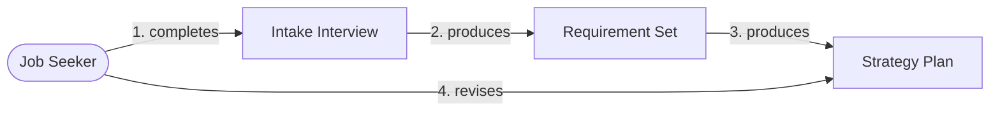
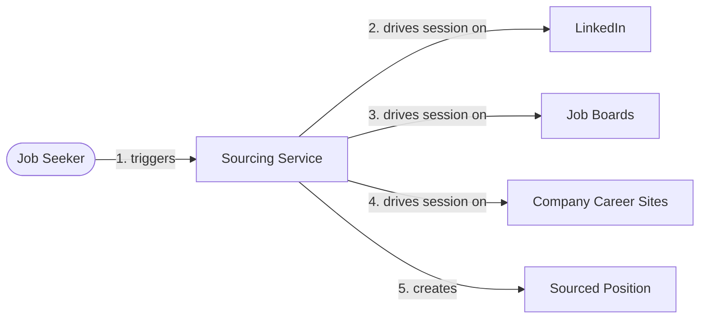
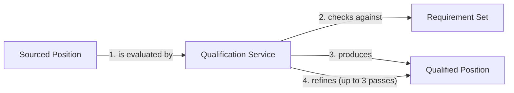
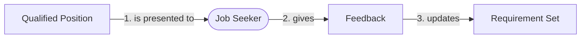
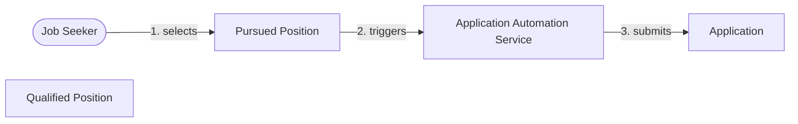
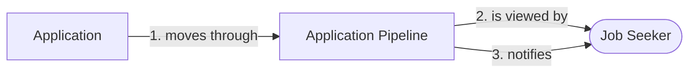
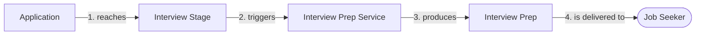
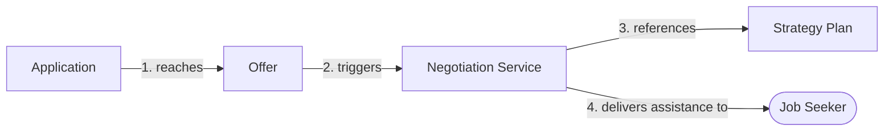

# Domain Storytelling — Career Coach

> 📦 **Ported from `singularity` on 2026-09-08.** Content is unchanged; the only edits are this
> banner and the links that could not survive the move, which are **marked in place rather than
> redirected** — see the corpus README.
> Part of the Career Coach corpus — see [the corpus README](../../README.md).
> 🔴 Links outside this corpus resolve only in a `singularity` checkout and are **not ported**.
> Provenance: [ADR-002](../../../../architecture/adr-002-lean-agile-os-is-the-upstream-platform.md).

_Eight Domain Stories — one per Story Map Activity — narrating each Activity's stories as
Actor/WorkObject/Activity flows, surfacing example scenarios for Three Amigos (Workshop 6) to
later compose into Gherkin. No prior Domain Storytelling artifact exists for this project._

**Authored from scratch** in this session. Source input: the 14 stories (CC-001–CC-014, plus
CC-000-ZT) across 8 populated Activities in [03-user-story-map.md](03-user-story-map.md); Actor
grounding from [02-vpc-job-seeker.md](02-vpc-job-seeker.md); vocabulary informed by job-search's
existing agent pipeline terminology where career-coach directly supersedes it (Position,
Requirement, Qualification).

> **Notation choice:** this artifact uses **Mermaid flowcharts**, not Egon — following the
> `developer-portal` precedent (`04-domain-storytelling.md` (🔴 not ported from `singularity`)),
> not the `freelance-marketplace` precedent that used Egon as a deliberate
> `ADR-016` (🔴 not ported from `singularity`) exception for a two-story,
> presentation-grade case study. Eight single-segment stories authored directly from a Story Map
> (rather than reviewed after the fact from a live domain expert session) are adequately served by
> Mermaid, this repo's default diagram tooling; nothing here needed Egon's interactive canvas or
> SVG export.

> **Gherkin-composition boundary:** this document surfaces **example scenarios** — concrete
> situations, described in prose — not `Given/When/Then` blocks. Three Amigos (Workshop 6), after
> Architecture Design (Workshop 5), composes the actual Gherkin.

---

## Story 1 — Job Seeker Builds a Strategy Plan _(Activity 1, Sprint 1 — CC-001–003)_

| #   | Actor            | Activity  | Work Object      | Traces to |
| --- | ---------------- | --------- | ---------------- | --------- |
| 1   | Job Seeker       | completes | Intake Interview | CC-001    |
| 2   | Intake Interview | produces  | Requirement Set  | CC-001    |
| 3   | Requirement Set  | produces  | Strategy Plan    | CC-002    |
| 4   | Job Seeker       | revises   | Strategy Plan    | CC-003    |

**Business rule annotation:** a Strategy Plan cannot exist without a completed Requirement Set —
sourcing (Story 2) has nothing to qualify against until this story completes. Revising the Plan
(step 4) updates the Requirement Set it's built from, not a disconnected copy.

**Example scenarios:**

- Job Seeker answers job requirements, location preference (on-site/hybrid/remote), salary range,
  and company-size preference during intake, plus additional career-coach/recruiter
  best-practice questions.
- Job Seeker later revises the Plan after realizing the initial salary range was unrealistic for
  the target market — the revision updates the Requirement Set used by all future sourcing passes.
- Job Seeker checks the Plan mid-search to assess progress and decide whether to broaden or narrow
  requirements.

---

## Story 2 — System Sources Positions _(Activity 2, Sprint 2 — CC-004)_

> ⚠️ **SUPERSEDED 2026-08-13 by [Iteration 02](../02/04-domain-storytelling.md).** This diagram
> shows ONE System Actor whose activity is _"drives session on"_. That is no longer true: the
> shipped adapter fetches a documented JSON API, and Architecture Design (AD-1) split the actor
> into **Board API Sourcing** (fetch at named companies) and **Sourcing Service** (browser
> discovery, narrowed). Read Iteration 02 instead. Kept here as the historical record.

| #   | Actor                               | Activity          | Work Object          | Traces to |
| --- | ----------------------------------- | ----------------- | -------------------- | --------- |
| 1   | Job Seeker                          | triggers          | Sourcing Service     | CC-004    |
| 2   | **Sourcing Service** (System Actor) | drives session on | LinkedIn             | CC-004    |
| 3   | **Sourcing Service** (System Actor) | drives session on | Job Boards           | CC-004    |
| 4   | **Sourcing Service** (System Actor) | drives session on | Company Career Sites | CC-004    |
| 5   | **Sourcing Service** (System Actor) | creates           | Sourced Position     | CC-004    |

**System actor named:** `Sourcing Service` owns the Playwright-driven browser automation — naming
it forces the same "which system owns this rule" question the BMC's flagged automation-risk
hypothesis depends on answering at Architecture Design.

**Business rule annotation:** a Sourced Position must de-duplicate against positions already
sourced from a different site (carried over from job-search's existing de-duplication rule) —
job-search's original constraint applies unchanged here.

**Example scenarios:**

- Sourcing Service finds the same posting on both LinkedIn and a company career site — the
  duplicate must be recognized, not created as two separate Sourced Positions.
- Sourcing Service encounters a CAPTCHA or rate-limit response mid-session — this is the concrete
  situation the BMC's flagged automation-risk hypothesis exists to resolve; no behavior is decided
  here.
- Sourcing Service runs against a company career site whose structure differs from a standard job
  board — the concrete "what does the Sourcing Service actually parse" question, deferred to
  Architecture Design.

---

## Story 3 — System Qualifies a Position _(Activity 3, Sprint 3 — CC-005–006)_

| #   | Actor                                    | Activity                 | Work Object           | Traces to |
| --- | ---------------------------------------- | ------------------------ | --------------------- | --------- |
| 1   | Sourced Position                         | is evaluated by          | Qualification Service | CC-005    |
| 2   | **Qualification Service** (System Actor) | checks against           | Requirement Set       | CC-005    |
| 3   | **Qualification Service** (System Actor) | produces                 | Qualified Position    | CC-005    |
| 4   | **Qualification Service** (System Actor) | refines (up to 3 passes) | Qualified Position    | CC-006    |

**Business rule annotation:** refinement is capped at 3 passes (carried directly from the
founder's own workflow description) — a 4th pass is not a Qualification Service behavior, it's a
Candidate Feedback Loop behavior (Story 4).

**Example scenarios:**

- A Sourced Position partially matches the Requirement Set on the first pass — the Qualification
  Service refines its analysis on a second and, if still ambiguous, a third pass before finalizing.
- A Sourced Position clearly fails a hard requirement (e.g. on-site only, when Requirement Set
  demands remote) — qualification finalizes as rejected without using all 3 passes.

---

## Story 4 — Job Seeker Gives Feedback and Refines Requirements _(Activity 4, Sprint 4 — CC-007–008)_

| #   | Actor              | Activity        | Work Object     | Traces to |
| --- | ------------------ | --------------- | --------------- | --------- |
| 1   | Qualified Position | is presented to | Job Seeker      | CC-007    |
| 2   | Job Seeker         | gives           | Feedback        | CC-007    |
| 3   | Feedback           | updates         | Requirement Set | CC-008    |

**Business rule annotation:** an updated Requirement Set (step 3) must be visible to Story 2's
Sourcing Service and Story 3's Qualification Service on their next run — this is the loop the BMC
flagged as new scope job-search never had (PJ4: "requirements discovered only after seeing real
postings never get fed back into sourcing").

**Example scenarios:**

- Job Seeker rejects a Qualified Position and notes "actually, I don't want fully remote if it
  means no PTO flexibility" — this refines a requirement the original intake missed, and the next
  Sourcing/Qualification pass reflects it.
- Job Seeker approves a Qualified Position without any requirement change — Feedback still records
  the approval so the same position isn't re-presented.

---

## Story 5 — Job Seeker Applies to Positions _(Activity 5, Sprint 5 — CC-009–010)_

| #   | Actor                                             | Activity | Work Object                                | Traces to |
| --- | ------------------------------------------------- | -------- | ------------------------------------------ | --------- |
| 1   | Job Seeker                                        | selects  | Pursued Position (from Qualified Position) | CC-009    |
| 2   | Pursued Position                                  | triggers | Application Automation Service             | CC-010    |
| 3   | **Application Automation Service** (System Actor) | submits  | Application                                | CC-010    |

**System actor named:** `Application Automation Service` is distinct from `Sourcing Service` —
it acts on the candidate's behalf (submits data), not just reads public listings. This distinction
is exactly why the BMC/Story Map flag it as the higher-risk half of the automation hypothesis.

**Business rule annotation:** an Application cannot be submitted for a position the Job Seeker
hasn't explicitly selected as Pursued (step 1 must precede step 2) — no autonomous application
submission without candidate selection.

**Example scenarios:**

- Job Seeker selects 5 Qualified Positions to pursue in one sitting — 5 Applications are created,
  one per selected position, each independently tracked from here forward (Story 6).
- Application Automation Service encounters a career site whose application form requires a
  document upload it can't yet handle — the concrete "what does the Application Automation Service
  actually support" question, deferred to Architecture Design alongside Story 2's equivalent.

---

## Story 6 — Job Seeker Tracks Applications _(Activity 6, Sprint 6 — CC-011–012)_

| #   | Actor                | Activity      | Work Object          | Traces to |
| --- | -------------------- | ------------- | -------------------- | --------- |
| 1   | Application          | moves through | Application Pipeline | CC-011    |
| 2   | Application Pipeline | is viewed by  | Job Seeker           | CC-011    |
| 3   | Application Pipeline | notifies      | Job Seeker           | CC-012    |

**Business rule annotation:** the Application Pipeline's stages are frozen vocabulary, carried
directly from the founder's own workflow description: `Submitted` → `Rejected` / `PhoneScreen` →
`HiringManagerSubmission` → `Interview` (repeatable per round through `FinalInterview`) →
`Offer` / `NoOffer`. No synonym ("In Review," "Screening") may coexist with these names.

**Example scenarios:**

- An Application moves from `PhoneScreen` to `HiringManagerSubmission` — Job Seeker is notified
  without needing to manually re-check the Application Pipeline.
- An Application is marked `Rejected` directly from `Submitted` (no phone screen occurred) — the
  Pipeline records the stage it was rejected at, not just a generic "rejected" flag.
- Job Seeker views the Pipeline with 5 Applications at different stages simultaneously — each
  Application's current stage is visible without cross-referencing separate views.

---

## Story 7 — Job Seeker Prepares for an Interview _(Activity 7, Sprint 7 — CC-013)_

| #   | Actor                                     | Activity        | Work Object            | Traces to |
| --- | ----------------------------------------- | --------------- | ---------------------- | --------- |
| 1   | Application                               | reaches         | Interview Stage        | CC-013    |
| 2   | Interview Stage                           | triggers        | Interview Prep Service | CC-013    |
| 3   | **Interview Prep Service** (System Actor) | produces        | Interview Prep         | CC-013    |
| 4   | Interview Prep                            | is delivered to | Job Seeker             | CC-013    |

**Business rule annotation:** Interview Prep must be specific to the Interview Stage reached
(`PhoneScreen` prep differs from `FinalInterview` prep) — carried directly from PJ7's pain
("under-prepared for what that specific stage tests"), not generic interview advice.

**Example scenarios:**

- An Application reaches `PhoneScreen` — Interview Prep Service produces prep focused on
  screening-level questions (background, logistics, high-level fit).
- The same Application later reaches `FinalInterview` — Interview Prep Service produces different,
  deeper prep for that later stage, even though it's the same underlying Application.

---

## Story 8 — Job Seeker Negotiates an Offer _(Activity 8, Sprint 8 — CC-014)_

| #   | Actor                                  | Activity               | Work Object                  | Traces to |
| --- | -------------------------------------- | ---------------------- | ---------------------------- | --------- |
| 1   | Application                            | reaches                | Offer                        | CC-014    |
| 2   | Offer                                  | triggers               | Negotiation Service          | CC-014    |
| 3   | **Negotiation Service** (System Actor) | references             | Strategy Plan (from Story 1) | CC-014    |
| 4   | Negotiation Service                    | delivers assistance to | Job Seeker                   | CC-014    |

**Business rule annotation:** Negotiation Service must reference the original Strategy Plan (e.g.
its salary range) rather than negotiate blind — this is the Golden Thread link back to Story 1,
not a standalone feature.

**Example scenarios:**

- An Offer's stated salary is below the Strategy Plan's target range — Negotiation Service
  surfaces this gap explicitly rather than treating the Offer as automatically acceptable.
- An Offer meets or exceeds every Strategy Plan requirement — Negotiation Service still surfaces
  negotiable terms (start date, signing bonus, PTO) that the Plan didn't explicitly rank.

---

## Frozen Vocabulary Table

| Domain Term                    | Type                                   | Frozen Code Name               |
| ------------------------------ | -------------------------------------- | ------------------------------ |
| Job Seeker                     | Actor → Role                           | `JobSeeker`                    |
| Intake Interview               | Work Object                            | `IntakeInterview`              |
| Requirement Set                | Work Object                            | `RequirementSet`               |
| Strategy Plan                  | Work Object                            | `StrategyPlan`                 |
| Sourcing Service               | System Actor                           | `SourcingService`              |
| Sourced Position               | Work Object                            | `SourcedPosition`              |
| Qualification Service          | System Actor                           | `QualificationService`         |
| Qualified Position             | Work Object                            | `QualifiedPosition`            |
| Feedback                       | Work Object                            | `Feedback`                     |
| Pursued Position               | Work Object                            | `PursuedPosition`              |
| Application Automation Service | System Actor                           | `ApplicationAutomationService` |
| Application                    | Work Object                            | `Application`                  |
| Application Pipeline           | Work Object                            | `ApplicationPipeline`          |
| Interview Stage                | Concept (enum on Application Pipeline) | `InterviewStage`               |
| Interview Prep Service         | System Actor                           | `InterviewPrepService`         |
| Interview Prep                 | Work Object                            | `InterviewPrep`                |
| Offer                          | Work Object                            | `Offer`                        |
| Negotiation Service            | System Actor                           | `NegotiationService`           |

**Application Pipeline stage vocabulary (frozen, no synonyms):** `Submitted`, `Rejected`,
`PhoneScreen`, `HiringManagerSubmission`, `Interview` (per round, up to `FinalInterview`), `Offer`,
`NoOffer`.

---

## Open Items Carried Forward to Architecture Design (not resolved by this workshop)

| Hypothesis                                                                                                       | Surfaces at | Status                                                            |
| ---------------------------------------------------------------------------------------------------------------- | ----------- | ----------------------------------------------------------------- |
| `SourcingService`'s Playwright automation against LinkedIn/job boards/career sites is technically/legally viable | Story 2     | Unresolved — carried from BMC/Story Map                           |
| `ApplicationAutomationService`'s submission automation is technically/legally viable                             | Story 5     | Unresolved — carried from BMC/Story Map, higher risk than Story 2 |
| What `ApplicationAutomationService` actually supports (e.g. document uploads)                                    | Story 5     | New concrete question surfaced this workshop                      |
| What `SourcingService` actually parses on non-standard company career sites                                      | Story 2     | New concrete question surfaced this workshop                      |

---

## Next: Architecture Design Workshop (Workshop 5)

Every System Actor named above (`SourcingService`, `QualificationService`,
`ApplicationAutomationService`, `InterviewPrepService`, `NegotiationService`) is a candidate
bounded-context/service boundary for Architecture Design to confirm or restructure, alongside
resolving the automation-viability hypotheses this workshop surfaced but did not resolve.
