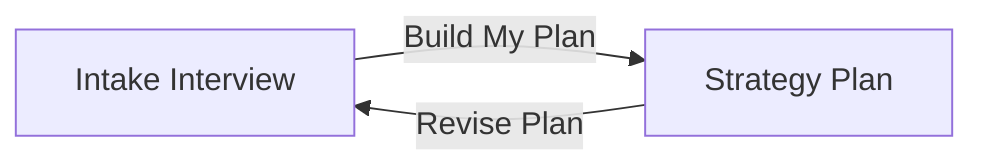
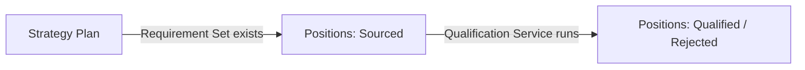
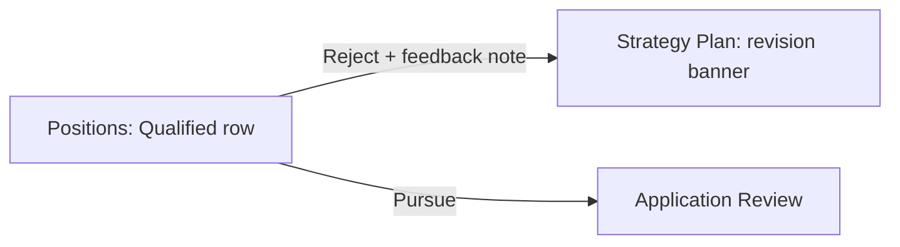
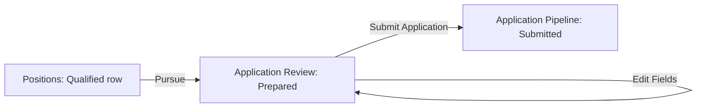
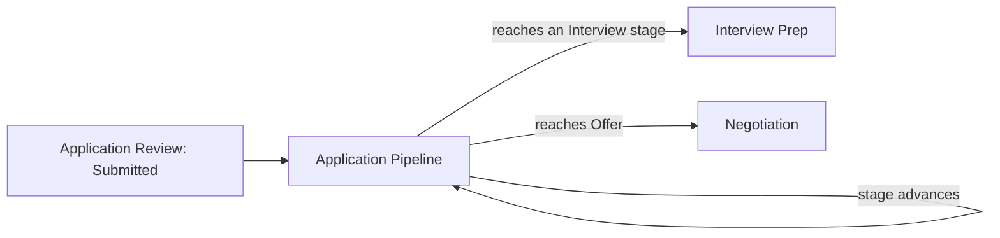
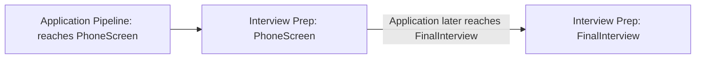
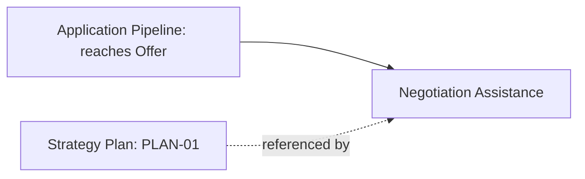

# UX Design — Career Coach

> 📦 **Ported from `singularity` on 2026-09-08.** Content is unchanged; the only edits are this
> banner and the links that could not survive the move, which are **marked in place rather than
> redirected** — see the corpus README.
> Part of the Career Coach corpus — see [the corpus README](../../README.md).
> 🔴 Links outside this corpus resolve only in a `singularity` checkout and are **not ported**.
> Provenance: [ADR-002](../../../../architecture/adr-002-lean-agile-os-is-the-upstream-platform.md).

_Concrete screens, navigation flows, and interaction specs, one section per Gherkin Feature from
[Workshop 6](06-three-amigos.md), in the same 1–8 order. Every `Then` clause below is mapped to a
specific UI element or state; every `When` clause is mapped to the interaction that triggers it.
Produced by the UX Design Workshop — UX Designer Primary; Product Owner, Architect, Developer
Contributing._

**Platform constraint:** career-coach is a new Angular app (`apps/career-coach/ui`) federated into
the platform shell per AD1's `scope:career-coach` placement, reusing `platform-iam` auth. Screens
below are specified as new routes/components inside that federation, using this monorepo's
existing Syncfusion-wrapped component patterns — not a greenfield design system.

**Feature 0 (Zero Trust) has no screen of its own:** "Protect Job Search Data by Default" is an
access-control behavior enforced platform-wide by `platform-iam`, not a distinct UI surface — its
`Then the request is rejected with "Access Denied"` clause is satisfied by the same shell-level
auth guard every other career-coach route sits behind, not a screen this workshop needs to mock up.

---

## Feature 1 — Build My Strategy Plan

**Screens:** `Intake Interview`, `Strategy Plan`

### Intake Interview

**Traces to:** `When I answer the intake interview with: remote only, salary range
$150,000-$180,000, mid-size to enterprise company size, and Full-Stack TypeScript/Angular/NestJS
stack preference` (Scenario: Complete the intake interview). Every field shown (location
preference, salary range, company size, tech stack, best-practice questions) corresponds directly
to that `When` clause's named answers.

**Interaction:** Submitting "Build My Plan" triggers `Then Requirement Set for
jordan.blake@example.com is recorded with those answers`, which navigates to the Strategy Plan
screen.

### Strategy Plan

**Traces to:**

- `Then Strategy Plan PLAN-01 exists for jordan.blake@example.com` / `PLAN-01 states the target
salary range as $150,000-$180,000` (Scenario: Receive the Strategy Plan built from intake) — the
  four fact rows shown (location, salary range, company size, tech stack).
- `Then PLAN-01's Requirement Set reflects the revised range of $140,000-$165,000` (Scenario:
  Revise the Strategy Plan) — the green "Recent revision" banner, showing the revised range and
  which Position's feedback (POS-2203) prompted it, per Feature 4's cross-reference.

**Interaction:** "Revise Plan" opens an edit form (not separately mocked — reuses the Intake
Interview screen's field layout) whose submission produces the revision banner shown here.

---

## Feature 2 — Source Positions

**Screen:** `Positions` (shared with Feature 3 and Feature 4 — one list, different states)

**Traces to:** `Then POS-2201 exists with status Sourced` (Scenario: Source a new Position) and
`Then only one POS-2201 record exists with status Sourced` (Scenario: De-duplicate) — both are
list-population states of the same `Positions` screen shown fully in Feature 3 below (a freshly
`Sourced` Position, before qualification, is a transient state not worth a separate mockup — it's
the same row shown mid-pipeline, one status badge earlier than `Qualified`/`Rejected`).

---

## Feature 3 — Qualify Positions

**Screen:** `Positions`

**Traces to:**

- `Then POS-2201's status becomes Qualified` (Scenario: Qualify a Position that matches all
  requirements) — POS-2201's row, green "Qualified" badge, `Pursue`/`Reject` actions enabled.
- `Then POS-2202's status becomes Rejected` / `the rejection reason states "fails remote-only
requirement"` (Scenario: Reject a Position that fails a hard requirement) — POS-2202's row, red
  "Rejected" badge, reason text shown directly beneath it (not hidden behind a click — Feature 4's
  feedback loop needs the reason visible to act on).
- `Then POS-2203's status becomes Qualified after the 2nd pass` (Scenario: Refine a borderline
  Position) — POS-2203's row, same green "Qualified" treatment as POS-2201; the mockup does not
  show the intermediate ambiguous-pass state, since no `Then` clause names an observable UI state
  for a pass in progress (only the final outcome is asserted).

**Interaction:** `Pursue`/`Reject` on a `Qualified` row are Feature 5's and Feature 4's triggers,
respectively — this one screen is the hub both flows launch from.

---

## Feature 4 — Give Feedback and Refine Requirements

**Screen:** `Positions` (same screen as Feature 3 — `Reject` action)

**Traces to:** `When I give feedback rejecting POS-2203 noting "I don't want fully remote without
flexible PTO"` / `Then PLAN-01's Requirement Set is updated` (Scenario: Reject a Qualified Position
and refine a requirement) — clicking `Reject` on a `Qualified` row (position-feed.svg) opens a
feedback-note field (not separately mocked — a small inline form beneath the row being rejected);
submitting it is what produces the Strategy Plan screen's revision banner shown in Feature 1.

`When I give feedback approving POS-2201` (Scenario: Approve without changing requirements) — the
`Pursue` action itself doubles as approval feedback; no separate "approve" control is needed since
pursuing a Position is already the strongest positive signal a Job Seeker can give it.

---

## Feature 5 — Apply to Positions

**Screen:** `Application Review`

**Traces to:**

- `Then POS-2201's status becomes Pursued` (Scenario: Choose a Qualified Position to pursue) — the
  triggering action (`Pursue` on the Positions screen), not a state this screen itself shows.
- `Then Application APP-3301 exists for POS-2201 with status Prepared` / `APP-3301's form fields
and any drafted cover letter are ready for my review` (Scenario: Prepare an Application) — the
  amber "Prepared" badge, populated Full Name/Resume/Cover Letter fields.
- `Then APP-3301's status becomes Submitted` / `the submission uses my own account, not an
autonomous action taken on my behalf` (Scenario: Submit the prepared Application myself) — the
  blue callout text explicitly stating the submission uses the Job Seeker's own account, and the
  "Submit Application" button being a deliberate user action, not an automatic transition. This is
  the single most important screen for communicating AD3's hybrid-submission decision — the callout
  exists specifically so the Job Seeker never mistakes this for full automation.

---

## Feature 6 — Track My Applications

**Screen:** `Application Pipeline`

**Traces to:**

- `Then APP-3301 shows status Submitted` (Scenario: View the Application's current pipeline
  stage) — the stage tracker's leftmost segment.
- `Then APP-3301's status becomes PhoneScreen` / `I receive an update notifying me of the change`
  (Scenario: Application advances to PhoneScreen) — the amber "PhoneScreen" segment highlighted as
  current, plus the blue notification banner at the top of the screen.
- `Then APP-3301's status becomes Rejected` / `the Pipeline records that the rejection occurred at
the Submitted stage` (Scenario: Application is rejected directly from Submitted) — the "Other
  Applications" row for `APP-3298`, showing a red "Rejected" badge with "at Submitted stage" noted
  explicitly, demonstrating the stage-of-rejection is recorded, not a generic rejected flag.

---

## Feature 7 — Prepare for Interviews

**Screen:** `Interview Prep`

**Traces to:**

- `Then I receive Interview Prep focused on screening-level questions: background, logistics, and
high-level fit` (Scenario: Receive prep for a PhoneScreen stage) — the "Stage: PhoneScreen" badge
  and the four bullet points shown, each matching one of the three named focus areas.
- `Then I receive Interview Prep focused on final-round depth, distinct from the earlier
PhoneScreen prep` (Scenario: Receive different prep at FinalInterview) — not separately mocked as
  its own screen; the footnote text at the bottom of this same mockup states explicitly that later
  stages produce different content, satisfying the "distinct from" clause without needing a second
  near-identical mockup for a different stage badge.

**Depends on Feature 6** — this screen is only reachable once `Application Pipeline` shows an
`InterviewStage` (per AD4's dependency map, restated here since it's this screen's precondition).

---

## Feature 8 — Negotiate My Offer

**Screen:** `Negotiation Assistance`

**Traces to:**

- `Then I am shown that $172,000 meets PLAN-01's target range` (Scenario: Offer meets the target
  range) — the green "within your target range" callout, comparing the offer against PLAN-01's
  stated range directly above it.
- `Then I still receive negotiation talking points for start date, signing bonus, and PTO, since
PLAN-01 did not explicitly rank those terms` (Scenario: Offer meets target range but has
  negotiable terms) — the four bullet points, each naming a term PLAN-01 didn't rank.
- The below-range Scenario (`Then I am shown that $140,000 is below PLAN-01's target range`) is not
  separately mocked — it is the same callout box shown in a red/amber "below range" treatment
  instead of green, the same pattern Feature 3's Position screen already uses for
  qualified-vs-rejected states; no new visual language is needed.

**Depends on Feature 6** (Application must reach `Offer`) and **Feature 1** (references `PLAN-01`,
already established since Sprint 1) — both per AD4.

---

## Traceability Confirmation

Every `Then`/`When` clause across all 9 Features in `06-three-amigos.md` maps to a screen state or
interaction above — no orphaned Gherkin. No screen or flow above lacks a traceable clause — the two
deliberate non-mockups (the ambiguous mid-pass qualification state in Feature 3; the below-range
Offer variant in Feature 8) were each confirmed to have no corresponding observable `Then` clause
requiring a distinct visual state, so their omission is a traceability finding, not a gap.

---

## Next: MVP Planning Workshop (Workshop 8)

Every screen above now has a concrete UI-scope estimate available for the v1 cut: `Intake
Interview`/`Strategy Plan` and `Positions` are the smallest, most self-contained pair (Sprint 1–4);
`Application Review`'s hybrid-submission callout (Feature 5) is the screen most directly carrying
AD3's scope-narrowing decision forward into MVP Planning's v1 cut discussion.
