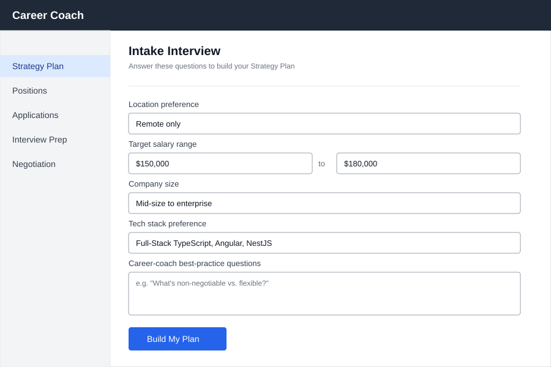
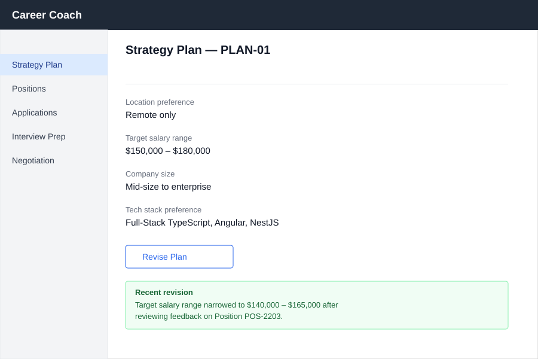
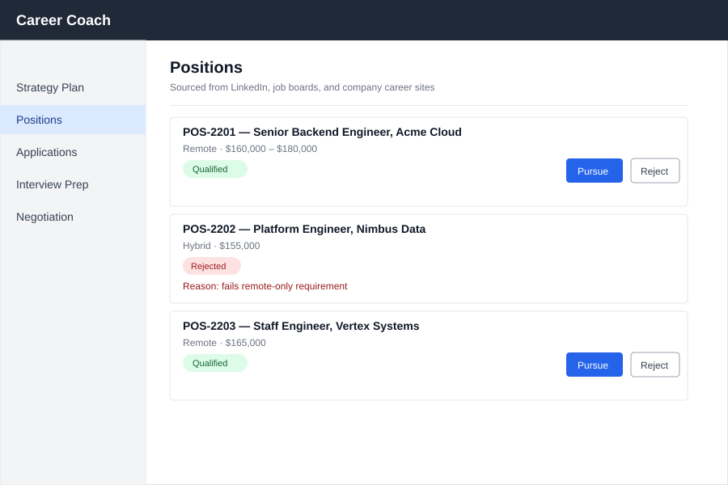
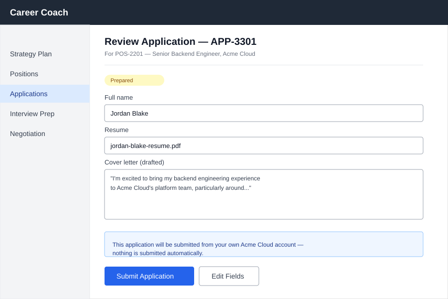
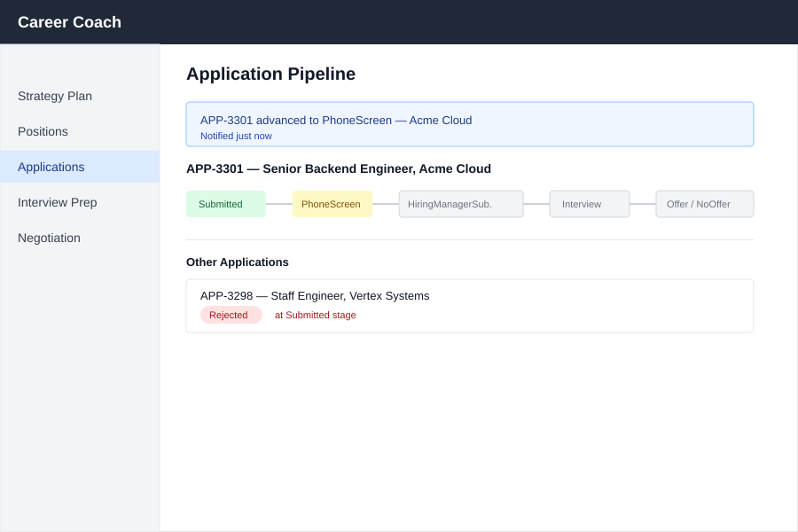
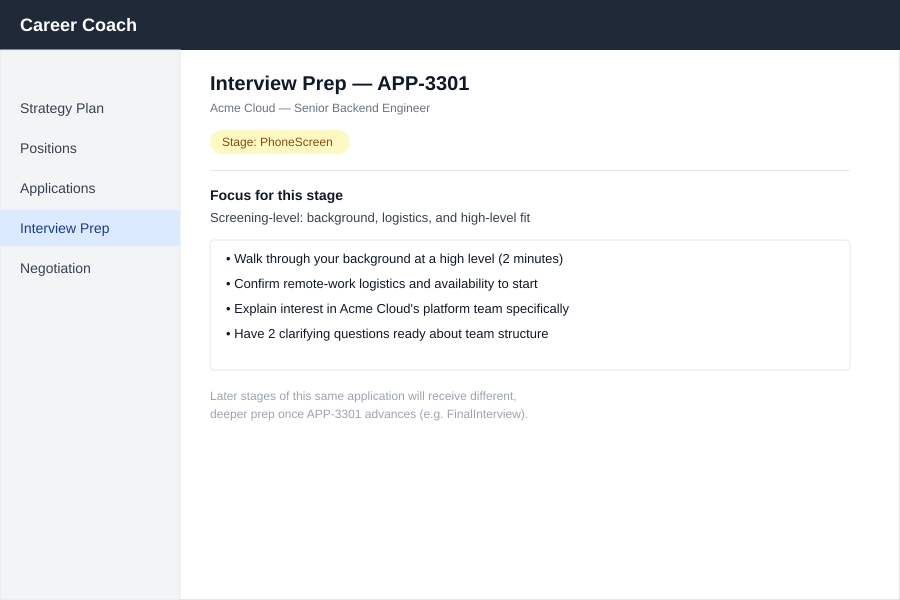
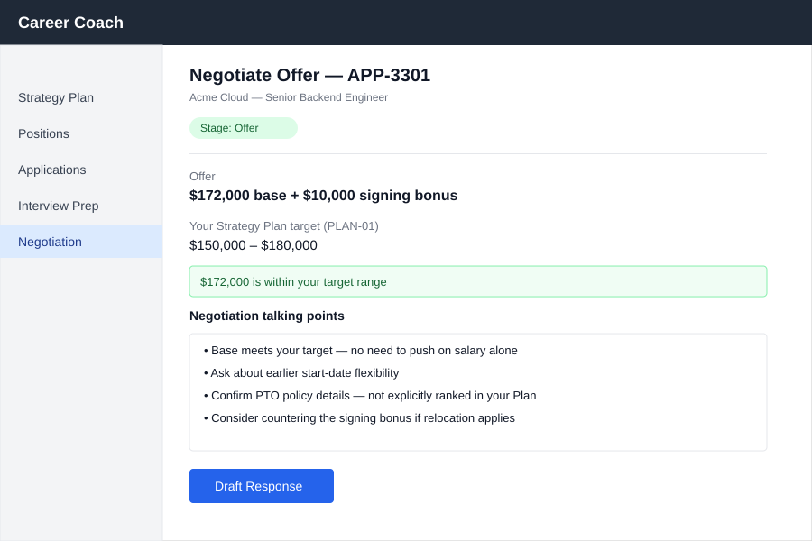

# Career Coach — Screen Mockups

> 📦 **Ported from `singularity` on 2026-09-08.** Content is unchanged; the only edits are this
> banner and the links that could not survive the move, which are **marked in place rather than
> redirected** — see the corpus README.
> Part of the Career Coach corpus — see [the corpus README](../../README.md).
> 🔴 Links outside this corpus resolve only in a `singularity` checkout and are **not ported**.
> Provenance: [ADR-002](../../../../architecture/adr-002-lean-agile-os-is-the-upstream-platform.md).

_All 7 screens from the UX Design workshop (Workshop 7 of 9), in navigation order. Source
mockups: `mockups/_.svg`. Full traceability to Gherkin `Then`/`When` clauses is in
[07-ux-design.md](07-ux-design.md); this document is a print/PDF-friendly companion showing
every screen with a plain-language description underneath.\*

---

## 1. Intake Interview



**Purpose:** The entry point to Career Coach. A Job Seeker answers a short set of structured
questions that becomes their Strategy Plan's Requirement Set.

**Key elements:**

- Left-hand nav showing the five app sections (Strategy Plan, Positions, Applications,
  Interview Prep, Negotiation), with the current section highlighted.
- **Location preference** — free-text field, pre-filled example: "Remote only."
- **Target salary range** — two linked fields (low/high), pre-filled example: $150,000–$180,000.
- **Company size** — free-text field, pre-filled example: "Mid-size to enterprise."
- **Tech stack preference** — free-text field, pre-filled example: "Full-Stack TypeScript,
  Angular, NestJS."
- **Career-coach best-practice questions** — an open textarea prompting the Job Seeker with
  guidance like "What's non-negotiable vs. flexible?"
- **Build My Plan** button — primary call to action at the bottom.

**Interaction:** Submitting "Build My Plan" records a Requirement Set for the Job Seeker and
navigates to the Strategy Plan screen. This same field layout is reused (not separately mocked)
as the "Revise Plan" edit form reachable from Strategy Plan.

---

## 2. Strategy Plan



**Purpose:** The durable record of a Job Seeker's stated requirements (PLAN-01) — the single
source of truth every other screen in the app measures Positions, Applications, and Offers
against.

**Key elements:**

- Four read-only fact rows mirroring the Intake Interview's answers: location preference,
  target salary range, company size, tech stack preference.
- **Revise Plan** button — opens the Intake Interview's field layout pre-filled with current
  values, for editing.
- **Recent revision** banner (green) — appears after a revision, stating the specific field that
  changed (e.g. salary range narrowed to $140,000–$165,000) and which Position's feedback
  prompted it (e.g. POS-2203).

**Interaction:** This screen is both a starting point (nothing to pursue yet) and a return
destination — a rejected Position with feedback can update the Requirement Set here, which is
what produces the revision banner. Negotiation Assistance later references PLAN-01's salary
range without navigating back to this screen.

---

## 3. Positions



**Purpose:** The shared hub screen for sourcing, qualifying, and acting on job Positions — one
list, several row-level states, reused across three Gherkin Features (Source, Qualify, Give
Feedback).

**Key elements:**

- A list of Position cards, each showing: title/company, remote/hybrid + salary snippet, a
  colored status badge, and (when Qualified) `Pursue`/`Reject` action buttons.
- **Qualified** badge (green) — e.g. POS-2201, POS-2203 — both actions enabled.
- **Rejected** badge (red) — e.g. POS-2202 — with the specific rejection reason shown directly
  beneath the row (e.g. "fails remote-only requirement"), not hidden behind a click.

**Interaction:** `Pursue` on a Qualified row moves that Position to Application Review. `Reject`
opens an inline feedback-note field (not separately mocked); submitting it is what produces the
Strategy Plan's revision banner. A freshly `Sourced` Position (before qualification finishes) is
a transient state shown one badge earlier than Qualified/Rejected — not worth a separate mockup.

---

## 4. Application Review



**Purpose:** Where a drafted Application is reviewed and, crucially, deliberately submitted by
the Job Seeker themselves — never on their behalf automatically.

**Key elements:**

- **Prepared** badge (amber) at the top.
- Populated **Full name**, **Resume**, and **Cover Letter (drafted)** fields.
- A blue callout stating explicitly: _"This application will be submitted from your own Acme
  Cloud account — nothing is submitted automatically."_
- **Submit Application** (primary) and **Edit Fields** (secondary) buttons.

**Interaction:** This is the single most important screen for communicating the hybrid-submission
architecture decision (AD3) — the callout exists specifically so the Job Seeker never mistakes
this step for full automation. Submitting moves the Application into the Application Pipeline
with status Submitted.

---

## 5. Application Pipeline



**Purpose:** Tracks a submitted Application's progress through hiring stages over time, and
surfaces other in-flight Applications for comparison.

**Key elements:**

- A blue notification banner announcing the most recent stage change (e.g. "advanced to
  PhoneScreen").
- A horizontal **stage tracker**: Submitted → PhoneScreen → HiringManagerSub. → Interview →
  Offer/NoOffer, with the current stage highlighted.
- **Other Applications** section — a second list showing sibling Applications and their own
  status, including rejections with the specific stage the rejection occurred at (e.g. "Rejected
  at Submitted stage" for APP-3298) rather than a generic rejected flag.

**Interaction:** Reaching an Interview-family stage unlocks Interview Prep for that Application;
reaching Offer unlocks Negotiation Assistance. The stage tracker advances in place — this is the
same screen re-rendered at each stage, not a new screen per stage.

---

## 6. Interview Prep



**Purpose:** Delivers interview preparation content tailored to the Application's current
pipeline stage — screening-level guidance early, deeper guidance later.

**Key elements:**

- **Stage: PhoneScreen** badge (amber).
- **Focus for this stage** summary line: "Screening-level: background, logistics, and
  high-level fit."
- Four bulleted, concrete prep points (e.g. "Walk through your background at a high level (2
  minutes)," "Confirm remote-work logistics and availability to start").
- A footnote stating that later stages of the same Application (e.g. FinalInterview) will
  receive different, deeper prep content once it advances.

**Interaction:** Only reachable once the Application Pipeline shows an interview-family stage.
The FinalInterview variant is not separately mocked — the footnote on this same screen satisfies
the "distinct from PhoneScreen prep" requirement without needing a near-identical second mockup.

---

## 7. Negotiation Assistance



**Purpose:** Helps the Job Seeker evaluate and respond to a received Offer against their
Strategy Plan's stated target range.

**Key elements:**

- **Stage: Offer** badge (green).
- The offer itself, e.g. "$172,000 base + $10,000 signing bonus."
- **Your Strategy Plan target (PLAN-01)** — the target range shown directly alongside the offer
  for comparison (e.g. $150,000–$180,000), referencing PLAN-01 without navigating to the
  Strategy Plan screen.
- A green callout: _"$172,000 is within your target range."_ (A below-range offer reuses this
  same callout in a red/amber treatment — the same visual pattern Positions already uses for
  qualified vs. rejected — so it isn't separately mocked.)
- **Negotiation talking points** — four bulleted, specific suggestions, including terms PLAN-01
  didn't explicitly rank (start date, signing bonus, PTO).
- **Draft Response** button.

**Interaction:** Only reachable once the Application Pipeline reaches Offer. Depends on both
Feature 6 (Pipeline reaching Offer) and Feature 1 (PLAN-01 already existing).

---

## Print / PDF

To generate a PDF from this file: open it in VS Code with a Markdown preview extension that
renders relative SVG image paths (e.g. "Markdown PDF") and export, or run:

```bash
npx md-to-pdf docs/planning/career-coach/iterations/01/screen-mockups.md
```

from the repo root — this preserves the relative `mockups/*.svg` image paths.
