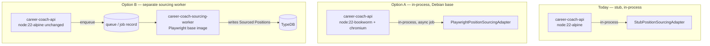

# Iteration 02 — Scope Proposal

> 📦 **Ported from `singularity` on 2026-09-08.** Content is unchanged; the only edits are this
> banner and the links that could not survive the move, which are **marked in place rather than
> redirected** — see the corpus README.
> Part of the Career Coach corpus — see [the corpus README](../../README.md).
> 🔴 Links outside this corpus resolve only in a `singularity` checkout and are **not ported**.
> Provenance: [ADR-002](../../../../architecture/adr-002-lean-agile-os-is-the-upstream-platform.md).

> **Status:** 🟢 **The four blocking decisions are TAKEN** (founder, 2026-08-12 — see Decisions
> below). The rest of this document remains a **proposal**, and **no workshop has been run**.
> **Written:** 2026-08-12 (third session of the day), autonomously, founder unavailable —
> then the decisions were taken with the founder later the same day.
> **Iteration opened:** `/start-mvp-iteration career-coach 02` — `iteration.json` is `in-progress`,
> `start-mvp-iteration` is on the Skill Call Stack.
>
> ⚠️ **What is decided is scope and shape, not architecture.** Architecture Design is still
> unrun, and the carry-forward table below is still unconfirmed. Do not read the green banner as
> workshop acceptance.

## What this document is, and what it is not

**It is the prep a founder-facilitated workshop would consume** — the objective, the prerequisites
that were verified against the repo rather than assumed, and the decisions that are genuinely the
founder's.

**It is not a workshop artifact, and no workshop has been run.** Every workshop Skill in this
hierarchy is founder-facilitated and every `stop-*` requires founder acceptance. With the founder
unavailable, running them solo would have meant inventing founder input and recording it as
accepted — the one failure mode this iteration exists to correct. So the workshops were not run.

---

## The objective

**Close gap 1 from Iteration 01's close** — the three automation-risk hypotheses that were carried
for an entire iteration and never validated.

The durable lesson `summary.md` recorded is the reason this is Iteration 02's objective rather
than a backlog item:

> A hypothesis whose validation method is "it gets exercised when the story ships" is not validated
> by the story shipping behind a stub.

| Hypothesis                                                   | Status after Iteration 01 | Blocked by                                    |
| ------------------------------------------------------------ | ------------------------- | --------------------------------------------- |
| Playwright-driven sourcing is technically and legally viable | ❌ Never exercised        | `IPositionSourcingPort` is bound to a stub    |
| CAPTCHA / anti-bot mitigation cost                           | ❌ Never observed         | Same stub — no real automation to hit a block |
| Application-submission automation (hybrid) is viable         | ❌ Never run end to end   | Out of this iteration's proposed scope        |

**Proposed scope: the first two.** Application submission is a separate risk with a separate
(higher) ToS posture, and AD3 already ruled it hybrid — human-in-the-loop. Folding it in here would
repeat Iteration 01's mistake of carrying more hypotheses than the work actually tests.

---

## Already done this session

**The single-use golden path is fixed** (test-first, ADR-012) — see
`parking-lot.md` (🔴 not ported from `singularity`). `StubPositionSourcingAdapter` now mints a genuinely
distinct batch on every pass, so v1 can be re-verified on demand instead of once per environment.

🔴 **Worth recording: the fix this repo had written down would not have worked.** The parking lot
proposed "have the stub mint fresh ids per pass". `Position.dedupeKey` is `title|company|location`
and deliberately **not** `positionId`, so fresh ids alone produce identical dedupe keys and change
nothing. Checked against the entity instead of taken from the note.

---

## Prerequisites — verified against the repo, not assumed

These are the reason this proposal exists. **Iteration 02 is not "swap one adapter class".** Three
findings, each verified on disk today, change the shape of the work.

### P1 — Playwright is a devDependency, and the runtime image strips it

`package.json` carries `@playwright/test` and `@nx/playwright` in **`devDependencies` only**;
`dependencies` has no Playwright entry. Every existing use in the repo is an `*-e2e` test project.

``apps/career-coach/api/Dockerfile:71`` (🔴 not ported from `singularity`) runs
`npm install --omit=dev` in the runtime stage. Binding the sourcing port to Playwright makes it a
**production runtime dependency** of a shipped service for the first time in this repo.

### P2 — 🔴 The runtime base image cannot run Playwright at all

``apps/career-coach/api/Dockerfile:62`` (🔴 not ported from `singularity`) is
`FROM node:22-alpine`. Playwright's browsers require glibc; Alpine is musl.

**Verified empirically** rather than from memory — `playwright-core`'s own download registry
(`node_modules/playwright-core/lib/server/registry/index.js`) enumerates host platforms explicitly,
and the complete Linux set is Ubuntu 18.04/20.04/22.04/24.04 and Debian 11/12/13, x64 and arm64.
**There is no Alpine or musl entry anywhere in the file.**

So this is not a tuning problem. Either the base image changes to a Debian-derived one (and the
image grows by the browser payload), or sourcing does not run inside `career-coach-api`.

### P3 — Sourcing is a synchronous HTTP command

``position.controller.ts:23-29`` (🔴 not ported from `singularity`)
exposes `POST /positions/source`, `await`s the whole command, and returns `204`. That is correct for
a stub that returns three fixtures instantly.

A real pass launches a browser, navigates, paginates, and parses across multiple sites. Held
request-scoped past a proxy/gateway timeout it blocks a request thread and fails for a reason that
has nothing to do with the hypothesis being tested. **The trigger shape likely has to change before
the adapter does.**

⚠️ **How long a real pass actually takes is _not_ measured, and spike S1 below does not measure
it.** S1 puts a floor under it — ~0.2s browser launch, ~0.44s for two local pages — which says the
mechanism is not inherently slow. What is unmeasured is network latency, page count across real
sites, and above all the deliberate politeness/rate-limit delays that avoid tripping anti-bot
defenses. Those delays are a design choice nobody has made yet, and they dominate the number. Treat
"this needs to be asynchronous" as a well-founded expectation, not a measurement.

### P4 — the good news: the dedupe design already holds

`Position.dedupeKey` keying on `title|company|location` rather than a source-site id is exactly what
real multi-site sourcing needs — the same posting found on a job board and on the company's own
career site collapses to one Position. AD2 got this right, and Workshop 6's Feature 2 second
Scenario already specifies it. **No domain change is required for real sourcing to dedupe
correctly.**

---

## Spike S1 — the parse mechanism, measured

**Question:** can Playwright drive a browser and parse a listing DOM into `SourcePositionParams`
in _this_ environment at all?

**Method:** a throwaway script against two **local** fixture pages — a listing grid, a `Next` link,
one card with no salary, and the same posting repeated on page 2 under a different req id. **No
third-party site was contacted.** The script and fixtures live in the session scratchpad and were
deliberately not committed: this was knowledge-gathering, not production code, and its shape would
prejudge the Option A/B decision.

**Result — it works, and one design claim is now evidence rather than reasoning:**

| Observation                   | Value                                         |
| ----------------------------- | --------------------------------------------- |
| Playwright / browser          | 1.59.1, headless Chromium, launched fine      |
| Pages visited (pagination)    | 2, terminating correctly on the absent `Next` |
| Raw candidates → after dedupe | 5 → 4                                         |
| Cross-page duplicate          | **1 collapsed correctly**                     |
| Card with no salary           | 1, tolerated — parsed, did not throw          |
| Browser launch / total run    | ~192 ms / ~438 ms                             |

🔴 **P4 is now empirically confirmed, not just argued.** The page-2 repeat (`R-9004`, same
title/company/location as `R-9001` under a different req id) is exactly the real-world case AD2
designed `dedupeKey` for, and it collapsed. Had dedupe keyed on the source site's id — the obvious
choice — it would have produced a duplicate Position.

**What S1 does NOT validate, and must not be read as validating:**

- ❌ **Neither automation-risk hypothesis.** Anti-bot defenses, CAPTCHA, login walls, rate limits
  and real-world DOM volatility are the entire substance of both, and a fixture page has none of
  them. **The hypotheses remain unvalidated**; this is the same "exercised behind a stub" trap
  Iteration 01 closed on, and calling S1 a validation would repeat it one iteration later.
- ❌ **Nothing about legality or ToS.** That is decision 2 below.
- ❌ **Not a timing estimate** — see the warning under P3.

What it _does_ retire is a real risk: that the mechanism itself is unworkable here. It is not.

---

## Architecture options

Current topology, and the two candidate shapes:

|                                       | **Option A — in-process, Debian base**                     | **Option B — separate sourcing worker**  |
| ------------------------------------- | ---------------------------------------------------------- | ---------------------------------------- |
| **Change to `career-coach-api`**      | Base image, +browser payload, Playwright to `dependencies` | None                                     |
| **Blast radius**                      | Every deploy of the API carries a browser                  | Isolated; API image stays as-is          |
| **Failure isolation**                 | A hung browser degrades the whole API                      | Worker crashes alone                     |
| **New infrastructure**                | None                                                       | A worker service + a job/queue mechanism |
| **Fastest to a validated hypothesis** | ✅ Yes                                                     | ❌ No — worker plumbing first            |
| **Right long-term shape**             | ❌ Doubtful                                                | ✅ Likely                                |

**No recommendation is recorded here deliberately** — this is precisely an Architecture Design
workshop decision, and AD is a founder-facilitated workshop. What this document does is make sure
that workshop starts from verified facts rather than from "swap the adapter".

⚠️ There is a real tension worth naming for that workshop: the option that validates the hypothesis
fastest (A) is probably not the option we want to keep (B). A spike under A that is explicitly
thrown away may beat committing to either.

---

## ✅ Decisions — taken by the founder, 2026-08-12

All four were put to the founder and answered. Two of them changed shape once evidence replaced
assumption, which is recorded below rather than tidied away.

| #   | Decision                                   | Outcome                                                                                                                                      |
| --- | ------------------------------------------ | -------------------------------------------------------------------------------------------------------------------------------------------- |
| D1  | Which site does the first real run target? | **Greenhouse/Lever-hosted career boards.** Structured, where a large share of senior SWE roles live, far lower ban risk than LinkedIn.       |
| D2  | ToS posture, and whose account?            | **Public and unauthenticated — no account at all.** D1 dissolved most of this question rather than answering it. ⚠️ See the open item below. |
| D3  | In-process, separate worker, or spike?     | **Sequenced.** JSON adapter in-process now; browser discovery as its own worker next.                                                        |
| D4  | May `career-coach-api` grow a browser?     | **Not for the JSON half — it never needed one.** Deferred, genuinely, to the worker decision. D3 and D4 are one axis, not two.               |

### D2's evidence, and what it changed

The endpoints were verified before deciding rather than taken on my recollection — read-only, one
request each:

- **Greenhouse** (`boards-api.greenhouse.io/v1/boards/{token}/jobs`) — `200` unauthenticated, no
  key. Returns `title`, `company_name`, `location.name`, `absolute_url`. 158–802 jobs per company
  across the four boards probed.
- **Lever** (`api.lever.co/v0/postings/{company}?mode=json`) — `200` unauthenticated; `404` for a
  company not on Lever. Returns `text` (title), `categories.location`, `descriptionPlain`,
  `hostedUrl`.

🔴 **Two findings that neither the proposal nor the founder anticipated, and that decided D3:**

1. **Both APIs are per-company, not searchable.** There is no "find all remote senior backend
   roles" endpoint — you supply a board token per company. The JSON path solves **fetching** and
   not **discovery**. A browser driving a job-board search page is what solves discovery, which is
   why the answer is hybrid rather than "JSON, done".
2. **Neither returns salary.** No salary/compensation field exists on either. Qualification depends
   on it. ⚠️ **Corrected 2026-08-13:** this originally said Workshop 6's Gherkin "rejects `POS-2202` against a `$150,000-$180,000` requirement". It does not — `POS-2202` is rejected for _failing remote-only_, and its salary passes. No Scenario exercised salary as a rejection reason at all. So
   salary must be extracted from description text regardless of transport; the unstructured-parsing
   problem moves, it does not disappear.

### The resulting plan

- **Now — JSON fetch adapter, in-process.** Pure HTTP, so no image change, no Playwright, no
  `dependencies` promotion. Triggered on a schedule via `@nestjs/schedule`, following the existing
  ``deactivate-expired-purchases.job.ts`` (🔴 not ported from `singularity`)
  precedent — which also answers **P3**, since a scheduled job is not request-scoped.
- **Next — browser discovery, as its own worker.** This is where P1/P2 land and where both
  automation-risk hypotheses finally get tested.

### 🔴 Open items this decision creates — neither is optional

- **The browser half must be SCHEDULED, not intended.** The founder accepted D3 on that condition.
  Sequencing is how this project deferred these same hypotheses for an entire iteration; the only
  thing separating "sequenced" from "deferred again" is a dated commitment with the hypothesis
  attached to it. If it is not in a sprint, it is not sequenced.
- **Nobody has read Greenhouse's or Lever's terms of use for automated access.** Confirming an
  endpoint is public and unauthenticated is not the same as confirming its terms permit programmatic
  polling. D2 rests on the first, and the second is unverified. **Do this before the first
  scheduled run, not after.**

---

## Which Iteration 01 artifacts carry forward

Proposed, for the founder to confirm at the first workshop:

| Artifact                    | Proposal                                                                                                                                                                                                                                                                    |
| --------------------------- | --------------------------------------------------------------------------------------------------------------------------------------------------------------------------------------------------------------------------------------------------------------------------- |
| `01-bmc.md`                 | **Carries forward.** Same segment, same value proposition. Its Hypothesis Register is this iteration's backlog.                                                                                                                                                             |
| `02-vpc-job-seeker.md`      | **Carries forward** — unchanged customer, unchanged jobs/pains/gains.                                                                                                                                                                                                       |
| `03-user-story-map.md`      | **Carries forward.** Sourcing is Activity 2; no new activity is proposed.                                                                                                                                                                                                   |
| `04-domain-storytelling.md` | ✅ **DONE 2026-08-13** — re-run for Story 2 and accepted. Split into 2a (Board API Sourcing) and 2b (Sourcing Service, narrowed to discovery), each with recorded business rules. Three Amigos is unblocked.                                                                |
| `05-architecture-design.md` | ✅ **DONE 2026-08-13** — re-run and accepted; AD-1 to AD-4 in [`05-architecture-design.md`](05-architecture-design.md). Its Open Items question ("what `SourcingService` actually parses on non-standard career sites") is answered per provider by the `BoardSource` seam. |
| `06-three-amigos.md`        | **Extend.** Feature 2's two Scenarios assume a pass always succeeds; real sourcing needs blocked/partial/retry Scenarios.                                                                                                                                                   |
| `07-ux-design.md`           | **Revisit lightly** — a minutes-long sourcing pass needs progress/failure states the current screens do not have.                                                                                                                                                           |
| `08-mvp-plan.md`            | **Re-cut**, and this time reconcile hypotheses against _evidence_, not against stories shipped.                                                                                                                                                                             |

---

## What this session did not do, and why

- **No workshop was run** — all nine are founder-facilitated, and their `stop-*` skills require
  founder acceptance. See the opening section.
- **No third-party site was contacted.** Decision 1 and 2 above are unanswered, and the risk
  (account ban, ToS) is the founder's to take, not mine to take on their behalf while they are away.
- **No production sourcing code was written.** The seam's shape is an Architecture Design output,
  and writing it first would prejudge Option A vs B — the exact decision the workshop exists to make.
