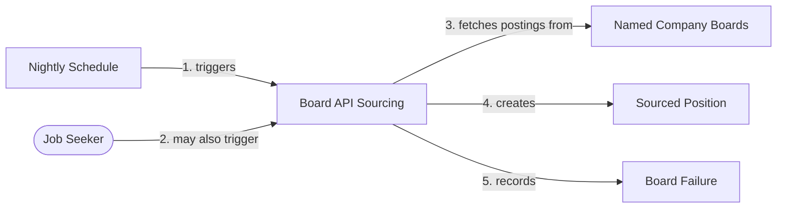
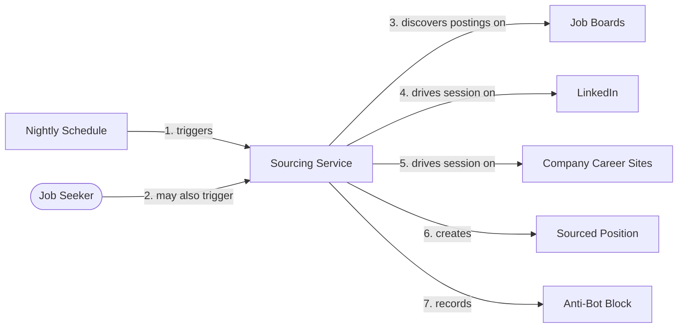

# Domain Storytelling — Iteration 02 (Story 2 re-run)

> 📦 **Ported from `singularity` on 2026-09-08.** Content is unchanged; the only edits are this
> banner and the links that could not survive the move, which are **marked in place rather than
> redirected** — see the corpus README.
> Part of the Career Coach corpus — see [the corpus README](../../README.md).
> 🔴 Links outside this corpus resolve only in a `singularity` checkout and are **not ported**.
> Provenance: [ADR-002](../../../../architecture/adr-002-lean-agile-os-is-the-upstream-platform.md).

> **Workshop:** 4 of 9 · **Attempt:** 1 · **Facilitated:** 2026-08-13
> **Scope:** Story 2 only. Stories 1 and 3–6 carry forward from
> [Iteration 01](../01/04-domain-storytelling.md) unchanged.
> **Why a re-run:** Architecture Design (AD-1) split Story 2's single System Actor in two, and the
> shipped adapter does not do what the Iteration 01 diagram says it does.

## What was wrong with the Iteration 01 story

Iteration 01's Story 2 shows **one** System Actor, `Sourcing Service`, whose activity against all
three targets is _"drives session on"_ — browser automation. Two things falsified it:

- **The shipped adapter fetches a documented JSON API.** It does not drive a session on anything.
- **AD-1 split the actor**, because fetching at named companies and discovering at unnamed ones are
  different capabilities with different risks — and only the second carries the automation
  hypotheses.

Architecture Design ran against the old story deliberately and recorded the gap rather than papering
over it. This workshop closes it.

**Artifacts:** [`story-2a-board-api-sourcing.egn`](04-domain-stories/story-2a-board-api-sourcing.egn) ·
[`story-2b-sourcing-service-discovery.egn`](04-domain-stories/story-2b-sourcing-service-discovery.egn)
— authored in egon.io's `.egn` format, matching Iteration 01's own artifact. Mermaid below mirrors
them for readability; the `.egn` files are the visual artifact and neither replaces the other.

---

## Story 2a — Board API Sourcing fetches from named companies

| #   | Actor                                 | Activity              | Work Object          | Traces to |
| --- | ------------------------------------- | --------------------- | -------------------- | --------- |
| 1   | **Nightly Schedule** (System Actor)   | triggers              | Board API Sourcing   | CC-004    |
| 2   | Job Seeker                            | may also trigger      | Board API Sourcing   | CC-004    |
| 3   | **Board API Sourcing** (System Actor) | fetches postings from | Named Company Boards | CC-004    |
| 4   | **Board API Sourcing** (System Actor) | creates               | Sourced Position     | CC-004    |
| 5   | **Board API Sourcing** (System Actor) | records               | Board Failure        | CC-004    |

**Business rules** (also in the `.egn`'s `domainStory.description`):

- **A sourcing pass is not all-or-nothing.** Positions from healthy boards are created; a failed
  board is **recorded**, so a permanently-broken board is visible rather than merely quiet.
- **De-duplication is unchanged and now spans mechanisms** — on `title|company|location`, never on
  the source site's own id, because no site is trusted to give a stable id across sites.
- 🔴 **Board API Sourcing cannot discover.** Both providers' APIs are per-company, so it only ever
  reaches companies already named in configuration. This is the capability gap Story 2b exists for.
- **The schedule is the normal path**; the Job Seeker's manual trigger is the exception.

**Example scenarios** (situations, not Gherkin — Three Amigos composes that):

- A pass runs three boards; one returns 404 and two succeed — 412 Positions are created and the
  failed board is recorded. **Observed live 2026-08-12**, not hypothesised.
- The same posting appears on two different companies' boards under different ids — one Sourced
  Position, not two. **Observed live**: 667 candidates collapsed to 661 distinct.
- A pass runs with no boards configured at all — nothing is created, and this is not an error.
- Every posting in a pass arrives with no salary. **Observed live: 0 of 667 carried one.**

---

## Story 2b — Sourcing Service discovers roles at unnamed companies

| #   | Actor                               | Activity              | Work Object          | Traces to |
| --- | ----------------------------------- | --------------------- | -------------------- | --------- |
| 1   | **Nightly Schedule** (System Actor) | triggers              | Sourcing Service     | CC-004    |
| 2   | Job Seeker                          | may also trigger      | Sourcing Service     | CC-004    |
| 3   | **Sourcing Service** (System Actor) | discovers postings on | Job Boards           | CC-004    |
| 4   | **Sourcing Service** (System Actor) | drives session on     | LinkedIn             | CC-004    |
| 5   | **Sourcing Service** (System Actor) | drives session on     | Company Career Sites | CC-004    |
| 6   | **Sourcing Service** (System Actor) | creates               | Sourced Position     | CC-004    |
| 7   | **Sourcing Service** (System Actor) | records               | Anti-Bot Block       | CC-004    |

**Business rules:**

- **Discovery is the half that delivers the BMC promise** — roles found _without_ the Job Seeker
  naming the company first.
- **Same de-duplication rule**, and it must collapse a posting found by **both** mechanisms.
- **A blocked site is recorded, not fatal** — same partial-pass rule as 2a.

🔴 **Both automation-risk hypotheses attach to THIS story and to nothing else.** Whether
Playwright-driven sourcing is technically and legally viable, and what CAPTCHA/anti-bot mitigation
costs, are the two Iteration 01 carried and never tested. **Story 2a shipping does not touch them** —
that is the "exercised behind a stub" trap restated, and naming the split is what keeps it visible.

**Example scenarios:**

- A site presents a CAPTCHA mid-session — the block is recorded and the pass continues with the
  other targets. _Carried forward from Iteration 01; still unobserved._
- A company career site's structure differs from a standard job board. _Still open — the per-site
  parsing question AD answers with the `BoardSource` seam._
- Discovery finds a posting that Board API Sourcing already created — one Position, not two.

---

## Cross-story rule surfaced here, owned by Story 3

**A Position with no salary is qualified on everything else, and its salary is flagged unknown.**
Absent data is not a failed requirement — which is deliberately different from a stated-but-too-low
salary, which does fail.

This constrains **Story 3 (Qualify Positions)**, not Story 2. Recorded here because this workshop
surfaced it and because it is currently false in the specification: Workshop 6's Feature 3 rejects
`POS-2202` for _failing remote-only_ — its salary passes, and **no Scenario exercised salary as a
rejection reason at all**. So DS-3 fills a hole rather than contradicting a Scenario.
**Three Amigos added the missing Scenario** ([`06-three-amigos.md`](06-three-amigos.md)).

⚠️ Corrected 2026-08-13 — as first written this section claimed Feature 3 rejected `POS-2202` on
salary. Reading the Gherkin showed otherwise.

---

## Vocabulary added

| Term                     | Meaning                                                                                      |
| ------------------------ | -------------------------------------------------------------------------------------------- |
| **Board API Sourcing**   | System Actor — fetches postings from company boards named in configuration. Cannot discover. |
| **Sourcing Service**     | System Actor — **narrowed** to browser-driven discovery at companies not already named.      |
| **Nightly Schedule**     | System Actor — the normal initiator of a sourcing pass.                                      |
| **Named Company Boards** | Work Object — the configured set of company boards. Being configuration is the point.        |
| **Board Failure**        | Work Object — a board that could not be reached during a pass.                               |
| **Anti-Bot Block**       | Work Object — a site refusing automated access.                                              |

⚠️ **`Sourcing Service` is narrowed, not retired.** In Iteration 01 it meant all sourcing; it now
means discovery only. Anything downstream still reading it as "all sourcing" is stale.
