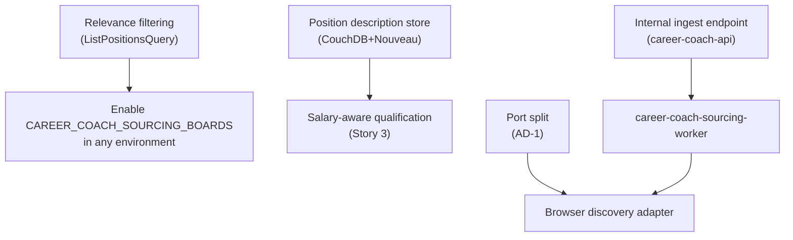

# Architecture Design — Iteration 02

> 📦 **Ported from `singularity` on 2026-09-08.** Content is unchanged; the only edits are this
> banner and the links that could not survive the move, which are **marked in place rather than
> redirected** — see the corpus README.
> Part of the Career Coach corpus — see [the corpus README](../../README.md).
> 🔴 Links outside this corpus resolve only in a `singularity` checkout and are **not ported**.
> Provenance: [ADR-002](../../../../architecture/adr-002-lean-agile-os-is-the-upstream-platform.md).

> **Workshop:** 5 of 9 · **Attempt:** 1 · **Facilitated:** 2026-08-13
> **Scope:** real Position sourcing — the half of Story 2 that Iteration 01 shipped behind a stub.
> **Traces to:** [`iterations/01/04-domain-storytelling.md`](../01/04-domain-storytelling.md) Story 2
> — see the 🔴 upstream gap below, which this workshop found and did not paper over.

## ✅ Upstream gap — CLOSED 2026-08-13

> Domain Storytelling was re-run for Story 2 after this workshop and is now accepted —
> [`04-domain-storytelling.md`](04-domain-storytelling.md), two stories with recorded business
> rules. **Three Amigos is unblocked.** The section below is the gap as this workshop found and
> recorded it, kept because it is why the re-run happened.

### As recorded at the time — this workshop ratified something its domain story did not describe

Iteration 02 has **no `04-domain-storytelling.md`**. The scope proposal called for re-running Domain
Storytelling for Story 2 and it was not done, so every decision here traces to **Iteration 01's**
Story 2.

That story names **one** System Actor, `Sourcing Service`, whose activity is _"drives session on"_
LinkedIn / Job Boards / Company Career Sites — browser automation. The JSON adapter shipped on
2026-08-12 does not drive a session on anything; it fetches a documented API. **The code and the
domain story disagree**, and AD-1 below resolves that by splitting the actor — which makes
Iteration 01's Story 2 diagram wrong rather than merely incomplete.

**Consequence: `04-domain-storytelling.md` must be re-run for Story 2 before Three Amigos.** Three
Amigos composes Gherkin from domain stories, and it would otherwise compose it from a diagram this
workshop has just invalidated.

---

## Decisions

| #    | Decision                                                                                                                                                                                                     | Founder       |
| ---- | ------------------------------------------------------------------------------------------------------------------------------------------------------------------------------------------------------------ | ------------- |
| AD-1 | **Two System Actors, two ports.** `Board API Sourcing` (fetch at named companies) is distinct from `Sourcing Service` (browser discovery). The port split lands **when the browser half lands**, not before. | ✅ 2026-08-13 |
| AD-2 | **The browser worker persists via career-coach-api over HTTP.** It owns no persistence and is not a second writer.                                                                                           | ✅ 2026-08-13 |
| AD-3 | **Relevance filtering belongs at query time**, in `ListPositionsQuery` — not in sourcing.                                                                                                                    | ✅ 2026-08-13 |
| AD-4 | **Position descriptions live in CouchDB+Nouveau**, not TypeDB. The 2026-07-26 reservation's trigger has fired.                                                                                               | ✅ 2026-08-13 |

### AD-1 — Two System Actors, one deferred split

`Board API Sourcing` and `Sourcing Service` are **different capabilities, not two implementations of
one**. One fetches every role at companies the Job Seeker already named; the other discovers roles
at companies they did not. Only the second carries the BMC's automation-risk hypotheses, and only
the second delivers the value proposition's actual promise — _"roles sourced … without manually
visiting each one"._

Keeping them behind one port is what would let the weaker mechanism stand in for that promise. That
is the Iteration 01 failure mode restated: **a capability shipping is not the hypothesis it was
attached to being validated.**

The **split itself is deferred** until the browser adapter exists. Splitting now yields one port
with an adapter and one with nothing behind it. The decision is recorded here, so nothing rests on
anybody remembering it.

### AD-2 — The worker is not a writer

`career-coach-sourcing-worker` posts candidates to an internal endpoint on `career-coach-api`, which
remains the single writer to the Position store.

🔴 This is the option that respects the standing founder directive in
``parking-lot.tasks.md`` (🔴 not ported from `singularity`) — _"No SaaS service should query
the IAM TypeDB database directly; all access must go through an API"_ — which career-coach is
subject to, because it shares the `iam` database. The alternative was rejected on that ground, not
on taste.

**Dependency Rule:** the worker depends inward on nothing; it speaks HTTP to an application-layer
endpoint and carries no `career-coach-domain` import. The browser driver stays behind
`IPositionSourcingPort`'s successor, so no Playwright type reaches a domain lib.

### AD-3 — Relevance is a read concern

Sourcing observes; qualification judges. Two companies produced **667** positions, unfiltered —
including Account Executive roles for a backend engineer — so the feed needs relevance, but putting
it in sourcing would discard postings at fetch time and couple sourcing to `StrategyPlan`.

`ListPositionsQuery` grows filtering instead. Every sourced Position stays available for
re-qualification when requirements change, which is exactly what Story 4's feedback loop needs.

### AD-4 — Descriptions go to the store that was already reserved for them

The Architecture Workshop of 2026-07-26 scoped CouchDB+Nouveau out **with a trigger attached**:
_"add that store only once a real story introduces the field."_ This workshop introduces the field.

Adding `description` to the shared `iam` schema would have been one additive line — the `description`
attribute already exists and two entities already own it — but it would have routed around a
decision already taken, and put multi-KB blobs into a 50-entity identity database shared by six
bounded contexts.

**The cross-project consequence is therefore WITHDRAWN**: no change to
`libs/platform/shared/infrastructure/src/lib/iam.schema.typeql` is required. It was isolated and put
to the founder separately per the workshop's step 7d, and the decision removed it.

> ⚠️ **Narrowed 2026-08-13 by Sprint 1 Planning (S1-3).** The sentence above is true **of
> descriptions**, which is what AD-4 decided. It is **not** true of the schema in general: Sprint 1
> Planning found that per-requirement qualification outcomes must persist, and took the decision to
> add one additive `qualification-outcomes-json @card(0..1)` attribute to `position` in that same
> file. **AD-4 is not reopened** — its reasoning was multi-KB description blobs in a shared identity
> database, and a short outcomes array is a different case; `strategy-plan.requirements-json`
> already stores career-coach's sibling data this way in the same file. Read this paragraph as
> _"descriptions do not go in the shared schema"_, not _"nothing does"_.
> See [`09-sprint-1-plan.md`](09-sprint-1-plan.md) § Persistence.

---

## Bounded context and aggregate placement

| Element                             | Bounded context      | Aggregate / layer                         | Dependency Rule                                                         |
| ----------------------------------- | -------------------- | ----------------------------------------- | ----------------------------------------------------------------------- |
| `Board API Sourcing` (System Actor) | `scope:career-coach` | `Position` — infrastructure adapter       | Implements a domain port; no domain import of `fetch` or provider types |
| `Sourcing Service` (System Actor)   | `scope:career-coach` | `Position` — infrastructure adapter       | Playwright confined to the worker; never reaches `type:domain`          |
| `career-coach-sourcing-worker`      | `scope:career-coach` | `type:app`                                | Speaks HTTP only; no `career-coach-domain` dependency                   |
| Position description store          | `scope:career-coach` | `Position` — infrastructure adapter       | New domain port, CouchDB adapter implements it — direction stays inward |
| Relevance filtering                 | `scope:career-coach` | `type:application` (`ListPositionsQuery`) | Reads criteria; no new aggregate                                        |

**No new aggregate.** Every element above serves the existing `Position` aggregate. `Position` gains
a description, which is an attribute of the posting it already models — not a new Work Object.

---

## Inter-item dependency map

| Must land first                            | Before                                    | Why                                                                                                                      |
| ------------------------------------------ | ----------------------------------------- | ------------------------------------------------------------------------------------------------------------------------ |
| Relevance filtering (`ListPositionsQuery`) | Enabling real sourcing in any environment | 667 unfiltered positions make the Story 2 → Story 3 handoff unusable; the feed is how a Job Seeker reaches qualification |
| Position description store                 | Salary-aware qualification (Story 3)      | Story 3 consumes what Story 2 produces — qualification cannot judge salary before the text it comes from is stored       |
| Internal ingest endpoint                   | `career-coach-sourcing-worker`            | AD-2 — the worker is not a writer, so the endpoint it posts to must exist first                                          |
| Port split (AD-1)                          | Browser discovery adapter                 | The split's trigger is the second implementation; the adapter is that implementation                                     |

### Cross-check against the Story Map's release slicing

[`03-user-story-map.md`](../01/03-user-story-map.md) places CC-004 in Sprint 2, already delivered.
**No ordering conflict** — every item above is new work inside an already-delivered story, not a
story pulled forward.

The Story Map's own hypothesis table lists _"Playwright-driven sourcing is technically/legally
viable"_ and _"CAPTCHA-solving/anti-bot-mitigation cost"_ as **"Unresolved — needs Architecture
Design"**. This workshop does **not** resolve them: it decides where the browser will live and how
it will persist, which is a prerequisite for testing them, not a test. They stay unresolved and are
attached to the browser discovery adapter.

---

## Open items carried out of this workshop

1. 🔴 **Re-run Domain Storytelling for Story 2** before Three Amigos — see the upstream gap above.
2. 🔴 **The browser half must be scheduled, not intended.** Unchanged from the scope proposal, and
   this workshop makes it sharper: AD-1 explicitly attaches both hypotheses to the browser adapter,
   so nothing else landing can be mistaken for progress against them.
3. ✅ **Greenhouse/Lever terms of use — READ 2026-08-13. Cleared for current usage.**
   - **Greenhouse:** the Job Board API is documented public and unauthenticated (_"Job Board data is
     publicly available, so authentication is not required for any GET endpoints"_) and explicitly
     intended for third parties to build career pages.
     `boards-api.greenhouse.io/robots.txt` disallows **only** `/embed/` — our
     `/v1/boards/{token}/jobs` path is not disallowed. No rate limit is stated.
     🔴 The _"spiders, robots, crawlers"_ prohibition that a search surfaces belongs to the **My
     Greenhouse User Agreement**, which defines "the Services" as `my.greenhouse.io` (the
     candidate-profile product) and binds people who create an account and accept. **We never touch
     that host.** The Sourcing Automation Addendum governs Greenhouse's own product for customers,
     and the MSA binds employers — neither reaches a third party reading public postings.
   - **Lever:** the Postings API is officially supported and public (Lever's own GitHub).
     `api.lever.co/robots.txt` is `Allow: /` with **`Crawl-delay: 1`** — explicitly permitted, with a
     stated pace. The documented `429` applies to **application POSTs** (>2/sec), not reads.
     ⚠️ Do not confuse `www.lever.co/robots.txt` (which disallows `/api/`) with `api.lever.co` — a
     different host.
   - **Current usage is trivially compliant:** 1 GET per board per nightly pass — 2 requests a night.
     ⚠️ Not legal advice; this is a reading of publicly available documents on 2026-08-13.

4. 🔴 **NEW CONSTRAINT — Lever publishes `Crawl-delay: 1`, and our adapter implements no delay at
   all.** Harmless today at 2 requests a night. It becomes binding the moment AD-4's description
   store lands, because that means per-job calls. **Any per-job fetching must honour a ≥1s delay for
   Lever**, and Greenhouse's ~570-calls-per-pass volume needs a pace chosen deliberately rather than
   inherited from "no delay".
5. **Greenhouse has no description on its list endpoint**, so the description store implies a
   per-job call there (~570 per pass at Stripe scale). See constraint 4 — this is no longer merely
   "undesigned", it now has a published number to honour on the Lever side.
