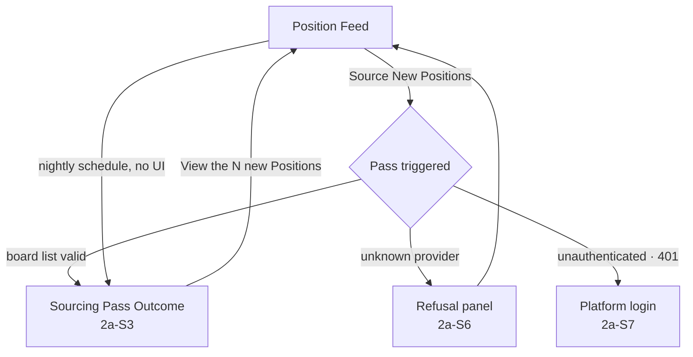
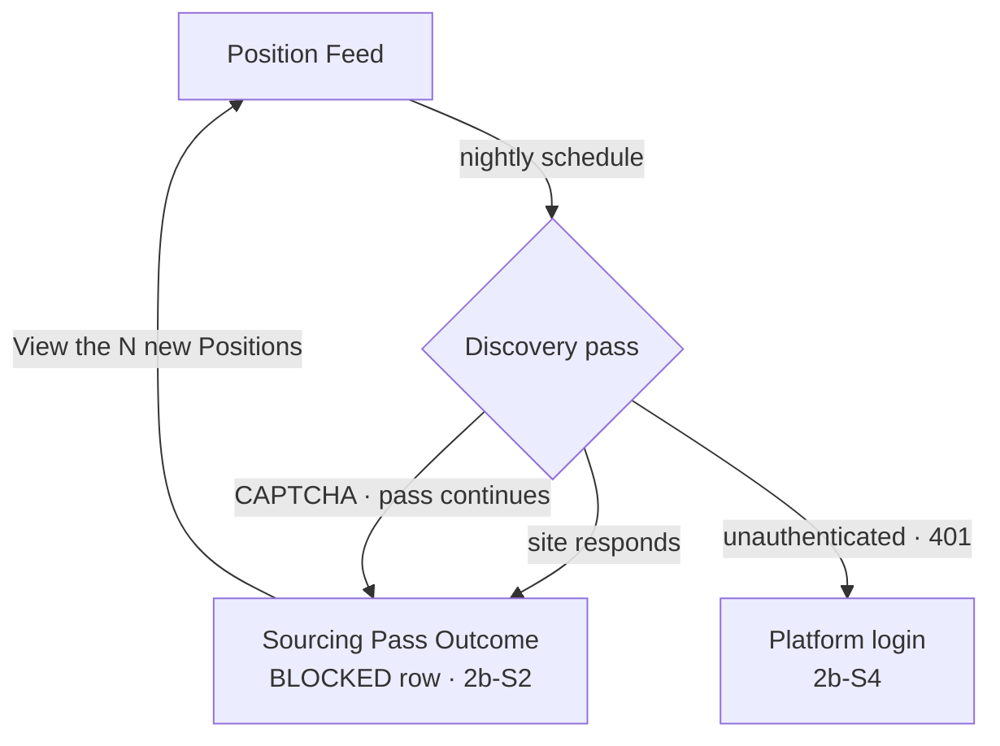
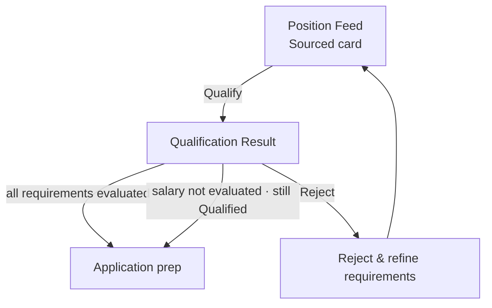

# UX Design — Iteration 02

> 📦 **Ported from `singularity` on 2026-09-08.** Content is unchanged; the only edits are this
> banner and the links that could not survive the move, which are **marked in place rather than
> redirected** — see the corpus README.
> Part of the Career Coach corpus — see [the corpus README](../../README.md).
> 🔴 Links outside this corpus resolve only in a `singularity` checkout and are **not ported**.
> Provenance: [ADR-002](../../../../architecture/adr-002-lean-agile-os-is-the-upstream-platform.md).

> **Workshop:** 7 of 9 · **Attempt:** 1 · **Facilitated:** 2026-08-13
> **Scope:** the UI states Iteration 02's Gherkin implies — Features 2a and 2b, plus the one
> Scenario added to Feature 3. Screens for Features 1 and 4–6 carry forward from
> [Iteration 01](../01/07-ux-design.md) unchanged.
> **Grounded in:** [`06-three-amigos.md`](06-three-amigos.md). Every state and transition below
> cites the clause it comes from.

## Key screens

| Screen                   | Mockup                                                             | Covers                                   |
| ------------------------ | ------------------------------------------------------------------ | ---------------------------------------- |
| Position Feed (filtered) | [`position-feed-filtered.svg`](mockups/position-feed-filtered.svg) | 2a-S1, 2a-S2, 2a-S4, 2a-S5, 2b-S1, 2b-S3 |
| Sourcing Pass Outcome    | [`sourcing-pass-outcome.svg`](mockups/sourcing-pass-outcome.svg)   | 2a-S3, 2a-S6, 2b-S2                      |
| Qualification Result     | [`qualification-result.svg`](mockups/qualification-result.svg)     | F3-S1                                    |

**One screen is deliberately not mocked: the login redirect** for 2a-S7 and 2b-S4. Those Scenarios
end at `the request is refused with 401`, and the platform shell's existing OIDC login already owns
that surface — designing a second one would invent a screen the domain does not have.

---

## Position Feed — [`position-feed-filtered.svg`](mockups/position-feed-filtered.svg)

### States and the clauses they come from

| UI state                            | Traces to                                                                                      |
| ----------------------------------- | ---------------------------------------------------------------------------------------------- |
| Position card, status `Sourced`     | 2a-S1 _"Then Position gh-8077887 … exists with status Sourced"_                                |
| Card after a manual pass            | 2a-S2 _"Then Position gh-9001 (Platform Engineer, Stripe, Remote) exists with status Sourced"_ |
| **One** card for a repeated posting | 2a-S4 _"Then exactly one Position exists … And no duplicate Position is created"_              |
| **`salary not published`** badge    | 2a-S5 _"And gh-8077887's salary is recorded as unknown / And … is not discarded"_              |
| **`Discovered`** provenance badge   | 2b-S1 _"And ss-4401 was not sourced from any configured board"_                                |
| One card across both mechanisms     | 2b-S3 _"Then exactly one Position exists … And no duplicate Position is created"_              |
| Filter row + result count           | AD-3 — the decision this feed exists to serve                                                  |
| _"No Positions match this filter"_  | AD-3 — distinct from an empty feed (see below)                                                 |

### Interactions

- **Filter by title** (`input[name=titleFilter]`, on `change`) → re-queries and updates the count line.
- **Filter by status** (`select`) → same.
- **Clear** → resets both, shown only when a filter is active.
- **Source New Positions** → 2a-S2's `When I trigger Board API Sourcing myself`; on completion the
  view moves to the Sourcing Pass Outcome screen.
- **Qualify** on a `Sourced` card → opens Qualification Result.

### Two design decisions worth stating

🔴 **`salary not published` is a badge, not a blank.** 2a-S5 says the salary is _recorded as
unknown_ and the Position is _not discarded_. A blank field would read as a rendering bug or an
oversight; a badge says the board did not publish it. This is the visible half of DS-3, and on real
data it is **every** Position — 0 of 667 carried a salary.

🔴 **The empty state is two different messages.** _"No Positions match this filter"_ and _"No
Positions sourced yet"_ describe different situations, and showing the second when a filter is
active sends the reader to run a sourcing pass they do not need. Already implemented and asserted
in a test.

**Provenance badges are load-bearing, not decoration.** `Board API` and `Discovered` are how a
reader can tell which mechanism produced a Position — the distinction AD-1 and DS-1 split the
System Actor to preserve. Without them the feed re-merges what those workshops separated.

---

## Sourcing Pass Outcome — [`sourcing-pass-outcome.svg`](mockups/sourcing-pass-outcome.svg)

### States and the clauses they come from

| UI state                                 | Traces to                                                                                 |
| ---------------------------------------- | ----------------------------------------------------------------------------------------- |
| **"Completed with 1 board unavailable"** | 2a-S3 _"And the sourcing pass is not recorded as failed"_                                 |
| Per-board `OK` row with counts           | 2a-S3 _"Then Position gh-8077887 exists … And Position lv-a1b2c3d4 … exists"_             |
| Per-board **`FAILED`** row               | 2a-S3 _"And a Board Failure is recorded for greenhouse:nonesuch-xyz"_                     |
| **`BLOCKED`** row                        | 2b-S2 _"And an Anti-Bot Block is recorded for LinkedIn"_                                  |
| **Refusal panel** (alternative state)    | 2a-S6 _"Then the pass is refused naming provider 'workday' / And no Position is created"_ |

### The distinction this screen is built around

**A partial pass is neither a success nor a failure, and the banner must not round it to either.**
DS-2 made partial-success the domain rule; this screen is where that becomes visible. A green
"Sourcing complete" would hide a board that has been dead for a month; a red "Sourcing failed"
would misdescribe 37 new Positions that did arrive.

🔴 **The refusal panel is a separate state, not another row in the table.** 2a-S6's misconfiguration
is refused _before any pass runs_ — there are no per-board results to show, because nothing ran.
Rendering it as a failed row would imply the other boards were attempted. It also names the
offending provider, per the Scenario, rather than saying "configuration error".

### Interactions

- **View the N new Positions** → returns to the Position Feed.
- Board rows are read-only. Fixing a bad token is a config change, not an in-app action — and
  inviting an edit here would imply a capability that does not exist.

---

## Qualification Result — [`qualification-result.svg`](mockups/qualification-result.svg)

### States and the clauses they come from

| UI state                                  | Traces to                                                                     |
| ----------------------------------------- | ----------------------------------------------------------------------------- |
| `Qualified` badge                         | F3-S1 _"Then gh-9001's status becomes Qualified"_                             |
| Per-requirement `Met` row                 | Feature 3 (Iteration 01) — the existing qualification behaviour               |
| **`Not evaluated` row**                   | F3-S1 _"And the salary requirement is recorded as not evaluated for gh-9001"_ |
| _"not counted against the Position"_ copy | F3-S1 _"And gh-9001 is not rejected for having no salary"_                    |
| _"Qualified on 2 of 3 requirements"_      | F3-S1 — the honest reading of the two clauses together                        |

### Why the per-requirement breakdown exists at all

Before DS-3 the result was a single verdict. It cannot stay that way: a Position can now be
`Qualified` **without the salary requirement having been checked at all**, and a bare "Qualified"
badge would overstate what was verified.

The summary line — _"Qualified on 2 of 3 requirements. 1 could not be evaluated."_ — is the
smallest honest statement of that. **"Not evaluated" is deliberately a third visual treatment**,
neither the green tick of `Met` nor a red cross: DS-3's whole point is that absent data is not a
failed requirement, and reusing the failure treatment would say the opposite.

The provenance panel explains _why_ it could not be evaluated ("this board does not publish
salary"), so the state reads as a fact about the source rather than a defect in the app.

---

## Screen flows

### CC-004a — Board API Sourcing

### CC-004b — Sourcing Service Discovery

### CC-005/006 — Qualification, as changed by F3-S1

---

## Coverage check (Step 11) — both directions

**Every mockup state traces to a clause.** Each row of the three tables above cites one.

**Every `When`/`Then` in the Iteration 02 Feature set is represented:**

| Scenario | Represented by                                                         |
| -------- | ---------------------------------------------------------------------- |
| 2a-S1    | Feed — Sourced card                                                    |
| 2a-S2    | Feed — Source New Positions → Outcome                                  |
| 2a-S3    | Outcome — banner, OK rows, FAILED row                                  |
| 2a-S4    | Feed — single card for a repeated posting                              |
| 2a-S5    | Feed — `salary not published` badge                                    |
| 2a-S6    | Outcome — refusal panel                                                |
| 2a-S7    | Flow → platform login (existing surface, deliberately not re-designed) |
| 2b-S1    | Feed — `Discovered` badge                                              |
| 2b-S2    | Outcome — BLOCKED row                                                  |
| 2b-S3    | Feed — one card across both mechanisms                                 |
| 2b-S4    | Flow → platform login                                                  |
| F3-S1    | Qualification Result — `Not evaluated` row + summary line              |

**Nothing left unrepresented.**

---

## What this workshop is asking to be built

Two of the three screens do not exist yet, and one exists in part:

- **Position Feed** — filters and empty-state copy **shipped 2026-08-13** (AD-3). Still to build:
  the `salary not published` badge, the provenance badges, and the result count line.
- **Sourcing Pass Outcome** — **does not exist at all.** There is no pass-level state anywhere:
  failures currently go to the API log only. This is the surface the Domain Storytelling transcript
  deferred as _"partial success and tell the Job Seeker"_, noting there was no mechanism to carry
  pass-level outcome to the UI. This workshop is the point at which that mechanism becomes needed.
- **Qualification Result** — the screen exists; the per-requirement breakdown does not, and cannot
  until qualification returns per-requirement outcomes rather than a single verdict.

🔴 **Two of these three depend on data the API does not currently return.** That is a real input to
MVP Planning, not a detail — designing them was still correct, because the Gherkin already says the
system knows these facts.
