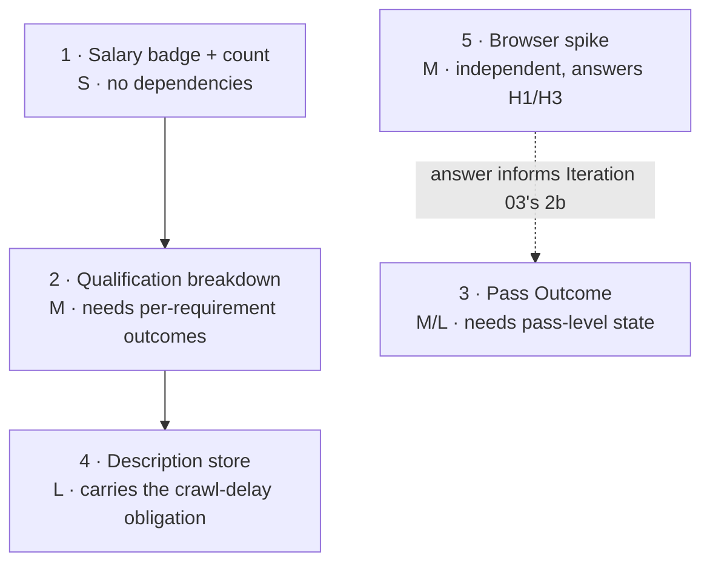

# MVP Plan — Iteration 02

> 📦 **Ported from `singularity` on 2026-09-08.** Content is unchanged; the only edits are this
> banner and the links that could not survive the move, which are **marked in place rather than
> redirected** — see the corpus README.
> Part of the Career Coach corpus — see [the corpus README](../../README.md).
> 🔴 Links outside this corpus resolve only in a `singularity` checkout and are **not ported**.
> Provenance: [ADR-002](../../../../architecture/adr-002-lean-agile-os-is-the-upstream-platform.md).

> **Workshop:** 8 of 9 · **Attempt:** 1 · **Facilitated:** 2026-08-13
> **Drawn from:** [`01-bmc.md`](../01/01-bmc.md) (Hypothesis Register) ·
> [`03-user-story-map.md`](../01/03-user-story-map.md) ·
> [`05-architecture-design.md`](05-architecture-design.md) (dependency map) ·
> [`06-three-amigos.md`](06-three-amigos.md) · [`07-ux-design.md`](07-ux-design.md)

## The cut

### Ships in Iteration 02

| #   | Item                                                           | Size | Traces to                       |
| --- | -------------------------------------------------------------- | ---- | ------------------------------- |
| 1   | **Salary badge + result count**                                | S    | UX-2, 2a-S5                     |
| 2   | **Qualification per-requirement breakdown**                    | M    | F3-S1, UX-3, DS-3               |
| 3   | **Sourcing Pass Outcome** — pass-level state + screen          | M/L  | 2a-S3, 2a-S6, 2b-S2, UX         |
| 4   | **AD-4 description store** + salary extraction + rate limiting | L    | AD-4, DS-3                      |
| 5   | **Browser-automation spike** — answers H1 and H3               | M    | Hypothesis Register (see below) |

**Already shipped this iteration**, and part of the same cut: the fixture-trap fix, Board API
sourcing (Feature 2a) with its nightly schedule, and AD-3 feed filtering.

### Deferred to Iteration 03

| Item                                                | Why deferred                                                                                                                                                                                                                   |
| --------------------------------------------------- | ------------------------------------------------------------------------------------------------------------------------------------------------------------------------------------------------------------------------------ |
| **Production Feature 2b** (discovery worker)        | The spike answers H1/H3 first. Committing to the AD-1/AD-2 architecture before either hypothesis has an answer risks building a shape the answer invalidates.                                                                  |
| **UX-4 provenance badges**                          | Two reasons, and each alone is sufficient: they need a `Position` domain + **shared-schema** change (there is no provenance field today), and they are **meaningless with one mechanism** — every card would read `Board API`. |
| Feature 2b's four Scenarios as production behaviour | Specification stands; implementation follows the spike's answer.                                                                                                                                                               |

🔴 **This is a real cut, not a rubber stamp.** The largest item in the backlog — production 2b —
is deferred, and with it the schema change UX-4 needs.

⚠️ **Honest sizing:** four build items plus a spike is a full iteration, and item 4 alone is large.
Sprint sequencing is Workshop 9's job, but this plan does not pretend the five fit in one sprint.

> **Resolved 2026-08-13 by Sprint 1 Planning (S1-1).** The cut was split **1, 2, 5 → Sprint 1** and
> **3, 4 → Sprint 2**. That workshop also **re-sized item 2 upward** — from `M` here to ≈4.5–5.5 days
> across five layers — after finding that per-requirement outcomes have to persist and `Position`
> stores only flat attributes. The `M` above was an honest estimate before that was known; the
> Sprint 1 plan's number supersedes it. Item 1 moved the other way, to Feature-layer-only, because
> `salaryRange` already exists end to end. See [`09-sprint-1-plan.md`](09-sprint-1-plan.md).

---

## 🔴 Hypothesis Register reconciliation

Every entry accumulated since the BMC workshop, with its disposition. **This is the section
Iteration 01 got wrong** — it asserted every hypothesis was "exercised by a story already in the v1
cut", which was true of the stories and false of the hypotheses.

| Hypothesis                                                      | Disposition                                                                                                                                                                                                                                                |
| --------------------------------------------------------------- | ---------------------------------------------------------------------------------------------------------------------------------------------------------------------------------------------------------------------------------------------------------- |
| **H1** — Playwright sourcing technically **and legally** viable | 🔄 **In the cut, via item 5.** Partly derisked, not answered: the ToS reading (2026-08-13) cleared Greenhouse/Lever **JSON APIs**, which is neither Playwright nor LinkedIn; spike S1 proved the mechanism against **local fixtures**, not a hostile site. |
| **H2** — application-submission automation viable               | ✅ **Resolved by decision, not deferred.** AD3 (Iteration 01) ruled hybrid — the system prepares, the human submits — rejecting full autonomy on ToS/account-ban risk. A hypothesis answered by deciding not to take the risk is answered.                 |
| **H3** — CAPTCHA / anti-bot mitigation cost                     | 🔄 **In the cut, via item 5.** Its own validation method gates it on H1, and the spike is built to observe it directly.                                                                                                                                    |
| **H4** — career-coach stays a personal, single-user tool        | ✅ Founder decision, not a hypothesis. Unchanged.                                                                                                                                                                                                          |
| **H5** — reuses platform-iam/api-gateway/shell                  | ✅ Founder decision, not a hypothesis. Unchanged. Re-confirmed by AD-2, which routes the future worker through `career-coach-api` rather than around the platform.                                                                                         |

**No entry is stranded by this cut.** H1 and H3 would have been, had production 2b been deferred
without a replacement — item 5 exists precisely so the deferral does not strand them.

**Checked for a cross-project answer before flagging anything**, per Step 7: `docs-store` returned
no matches for browser-automation viability or anti-bot, **and disk confirms it** — zero
`captcha`/`anti-bot` mentions across the knowledge base, and every Playwright usage in the repo is
an `*-e2e` project driving our own UI. Nobody here has driven a third-party site. So these are
genuinely unanswered rather than answered elsewhere.

### 🔴 The Register's own validation method is being rewritten

H1's recorded validation method is **_"Resolved at the Architecture Design workshop"_**. That
sentence is a large part of why Iteration 01 believed the hypothesis was handled: Architecture
Design _did_ run, and _did_ rule that sourcing proceeds — so the box looked ticked while nothing had
been tested.

**A workshop deciding to proceed is not a validation.** The method is rewritten to something
falsifiable:

> **H1/H3 validation method (from 2026-08-13):** the browser-automation spike (item 5) drives one
> real, named site and produces a **recorded observation** — did it work, did anti-bot appear, what
> would mitigation cost. The hypothesis is validated by that observation existing, not by a workshop
> having been held.

Propagated to [`01-bmc.md`](../01/01-bmc.md)'s Register.

---

## Item 5 — the spike, scoped

Deliberately **not** production 2b. It is the smallest thing that answers H1 and H3.

**Does:** drive **one** real named site with Playwright, unauthenticated, honouring `robots.txt` and
a deliberate delay; attempt to read a listing page; record what happened.

**Produces:** a written observation — reachable or blocked; whether a CAPTCHA/interstitial appeared;
what mitigation would cost if so; whether the parse seam holds against real DOM.

**Does not:** persist Positions, ship a worker, change `career-coach-api`'s image, or introduce the
AD-1 port split. **It is disposable by construction**, and the plan says so up front so nobody
later mistakes it for the start of production 2b.

🔴 **The site is a founder decision, taken at the spike, not here.** AD's decision 1 named
Greenhouse/Lever for the _API_ path; a browser spike against LinkedIn or a job-board search page is
a different ToS posture and has not been read or authorised.

---

## Sequencing (from AD's dependency map)

| Ordering call            | Why                                                                                                                                                                                                            |
| ------------------------ | -------------------------------------------------------------------------------------------------------------------------------------------------------------------------------------------------------------- |
| Item 2 **before** item 4 | The per-requirement breakdown is about the **absent** case, which is true today — 0 of 667 carried a salary. It does not wait on descriptions; item 4 later flips some rows from "not evaluated" to evaluated. |
| Item 5 **early**         | It is the only item whose _outcome changes later scope_. Running it last would mean planning Iteration 03 without its answer.                                                                                  |
| Item 4 **last**          | Largest, and the only one carrying an external obligation — Lever's `Crawl-delay: 1` plus ~570 Greenhouse calls per pass needing a deliberate pace.                                                            |
| Item 3 sits with either  | The 404 case exists today; the BLOCKED case only becomes real with 2b. Valuable now, more valuable later.                                                                                                      |

**No conflict with AD's dependency map.** Its one relevant row — _description store before
salary-aware qualification_ — is honoured: item 4 precedes any claim that salary requirements
actually bite, while item 2 only ever reports that salary **was not** evaluated.

---

## What this plan does and does not claim

**It claims:** the cut is drawn from real cost and dependency shape — including two costs discovered
during this workshop (provenance needs a schema change; the Register's validation method was not
falsifiable).

**It does not claim** that H1 or H3 are answered. They are **scheduled**, which is the specific
thing Iteration 01 failed to do, and item 5 is the schedule.
