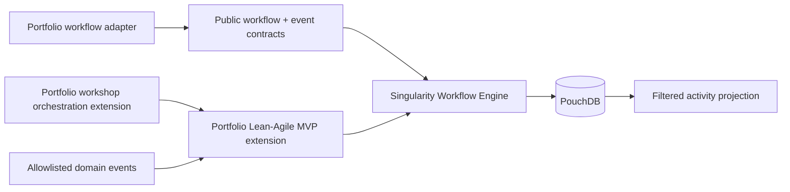

# Workflow Engine and Lean-Agile MVP Foundation — Feature Plan

**Status:** Phases 00–04 complete; Phase 05 is next
**Proposed branch:** `feat/workflow-engine-lean-agile-mvp-foundation`  
**Primary consumer:** Portfolio  
**Upstream capability owner:** Singularity Workflow Engine  
**Depends on:** [Interactive Examples scope](../interactive-examples-scope.md)

## Purpose

Make the Workflow Engine and Portfolio's Lean-Agile MVP extension the first Portfolio deliverable.
Every later Portfolio capability—Federated Identity, deletion lifecycle, Shell/Dashboard, Site
Builder, Career Coach, Prompt Workbench, deployment, and documentation—must run as a versioned
workflow through this foundation.

Portfolio is a real second consumer of the Workflow Engine. That is evidence for a public adapter
or extraction decision; it is not permission to copy private Singularity code into the public
Portfolio repository.

## Outcome

The completed foundation provides:

- a thin, documented Portfolio-to-Workflow-Engine adapter with no imports from private Singularity
  paths;
- a Lean-Agile MVP extension with explicit hypothesis, experiment, evidence, outcome, and
  pivot/persevere transitions;
- a workshop-orchestration extension that records the canonical nine-workshop sequence,
  versioned artifacts, inter-story dependencies, and controlled feedback propagation;
- PouchDB-backed, append-only, redacted domain-event recordings and immutable macro definitions;
- human-approved macro creation and command-based replay into disposable workspaces;
- a filtered Activity Feed projection contract that later Shell UI can consume through the gateway;
- container-safe PouchDB persistence rules; and
- a representative, non-production pilot proving deterministic recovery, audit, projection replay,
  and the proprietary-content exclusion.

## Architecture boundary

### Ownership

| Concern                                                                 | Owner                                              | Rule                                                               |
| ----------------------------------------------------------------------- | -------------------------------------------------- | ------------------------------------------------------------------ |
| Kernel lifecycle, CQRS contracts, state/audit ports, PouchDB primitives | Singularity Workflow Engine                        | Generic and framework/product neutral.                             |
| Portfolio adapter and presentation projection                           | Portfolio                                          | Calls public engine contracts only.                                |
| Lean-Agile MVP workflow definitions, schemas, gates, labels             | Portfolio extension                                | An extension module; never kernel behavior.                        |
| Workshop sequence, artifact graph, dependency and impact rules          | Portfolio workshop orchestration extension         | Child workflows; records artifact versions and feedback loops.     |
| Domain-event ingress                                                    | Portfolio adapter plus approved platform transport | Versioned envelopes, allowlisted types, idempotent consumption.    |
| Macro recordings and definitions                                        | PouchDB, through Workflow Engine contracts         | Append-only audit evidence and immutable macro versions.           |
| Agents, skills, prompts, private knowledge                              | Singularity only                                   | Excluded from Portfolio code, images, fixtures, and documentation. |

## Non-negotiable constraints

1. **No proprietary-content transfer.** Portfolio must not copy, publish, package, mount, or
   execute Singularity agents, skills, prompts, system instructions, model configuration, private
   knowledge, or agent execution history.
2. **PouchDB only for this workflow record.** Do not add SQLite as a second macro-recording store.
   The existing Workflow Engine PouchDB model is the authoritative local record.
3. **Events are evidence, not replay instructions.** Historical domain events are immutable audit
   facts. A reusable macro requires explicit intent, input bindings, branching/compensation policy,
   and human approval; replay dispatches commands into a disposable workspace.
4. **No direct data-store reads across service boundaries.** Consume only approved,
   versioned `PlatformEventEnvelope` messages. The cross-service transport is an adapter detail.
5. **No live data in images.** Docker images may contain only public PouchDB baselines or sanitized
   fixtures. Runtime state, provider keys, recordings, and encryption material stay outside the
   image and use runtime-injected secrets plus encrypted storage.
6. **No anonymous telemetry leak.** Activity projections are filtered server-side by derived
   `principalId` and `organizationId`; browser input never chooses either scope.
7. **Every phase uses the MVP extension once available.** Phase 01 establishes the minimal
   extension; all subsequent phase work is planned, evidenced, reviewed, and handed off through it.
8. **Workshops are traceable, not ceremonial.** Each workshop must record its consumed and
   produced artifact versions. A later finding that invalidates prior work must create an impact
   assessment, reopen the affected workshop, and revalidate downstream consumers.

## Phase plan

| #   | Phase                                     | Deliverable                                                                                                                          | Depends on | Exit gate                                                                                             |
| --- | ----------------------------------------- | ------------------------------------------------------------------------------------------------------------------------------------ | ---------- | ----------------------------------------------------------------------------------------------------- |
| 00  | Charter and contract freeze               | ADR set, public-contract inventory, data classification, approved event allowlist, and two-repository integration plan               | None       | No private Singularity imports/content can cross the proposed boundary.                               |
| 01  | Engine adapter and MVP extension baseline | Minimal Portfolio adapter plus Lean-Agile MVP workflow definition, schema, CQRS entry points, and phase evidence envelope            | 00         | A Portfolio workflow can start, transition, block, resume, and hand off through public contracts.     |
| 02  | PouchDB recording model                   | Versioned recording/macro documents, indexes, idempotency rules, redaction policy, snapshots, and recovery fixtures                  | 01         | Duplicate event delivery produces one logical recording; restore/replay evidence is green.            |
| 03  | Event ingress and macro authoring         | Approved-event subscriber, correlation/session grouping, human macro approval, immutable macro versions, and command replay contract | 02         | A seeded event sequence becomes a reviewed macro; replay never emits historical events.               |
| 04  | Lean-Agile MVP workflow completion        | Explicit hypothesis → experiment → evidence → outcome → pivot/persevere gates, validation, projections, and Cucumber scenarios       | 01–03      | A representative Portfolio initiative completes the methodology without an agent or skill transition. |
| 05  | Workshop contract and artifact graph      | Versioned `WorkshopRun`, `ArtifactVersion`, `ArtifactDependency`, and `ImpactAssessment` contracts; canonical workshop definitions   | 04         | Every workshop has declared inputs, output, owner, gates, and versioned artifact links.               |
| 06  | Workshop sequence and dependency gates    | Child-workflow orchestration for Workshops 1–9, dependency-map scheduling, MVP-cut hypothesis coverage checks, and projections       | 05         | A synthetic initiative completes the ordered workshop chain; blocked dependencies prevent bad order.  |
| 07  | Feedback propagation and revalidation     | Invalidation detection, impact assessment, workshop reopening, supersession links, downstream revalidation, and audit scenarios      | 05–06      | An upstream change propagates to every affected consumer with no artifact silently overwritten.       |
| 08  | Secure runtime and container proof        | Encrypted PouchDB runtime-store design, secret injection, public baseline fixture, backup/restore, and image-content audit           | 02–07      | Image inspection proves no live data/key; runtime recovery works from an approved encrypted store.    |
| 09  | Activity projection contract              | Per-principal/per-organization projection, retention window, gateway SSE contract, authorization tests, and replay checkpointing     | 02–07      | One principal receives only their filtered activity, including after reconnect/replay.                |
| 10  | Representative foundation pilot           | Three-session Portfolio workflow pilot using a synthetic/disposable principal and workspace; diagnostics and recovery report         | 01–09      | Deterministic resume, audit, macro replay, projection repair, redaction, and workshop feedback shown. |
| 11  | Second-consumer extraction decision       | Joint Portfolio/Singularity evidence review, adapter/extraction decision, migration plan or explicit deferral                        | 10         | Decision records whether Portfolio justifies a package/public adapter; no extraction is assumed.      |

## Phase 00 work package

Phase 00 is the first executable phase. It creates the decision and test boundaries required before
implementation branches are cut. Its working checklist and decision record are in
[Phase 00](phases/00-charter-contract-freeze/checklist.md).

### Checklist

- [ ] Create a joint Portfolio/Singularity ADR pair defining the public Workflow Engine contract.
- [ ] Confirm the exact public adapter surface: commands, queries, JSON envelopes, event envelope,
      error codes, and versioning policy.
- [ ] Define `MacroRecording` and `WorkflowMacro` document schemas, stable identities, revision
      semantics, redaction fields, and retention rules.
- [ ] Define the initial allowlist of event types and payload fields permitted into Portfolio's
      PouchDB recorder.
- [ ] Define the Lean-Agile MVP extension's states, gates, required evidence, and
      pivot/persevere decision record.
- [ ] Define how a Portfolio adapter uses the engine without importing private source paths,
      proprietary packages, or agent/skill artifacts.
- [ ] Define the PouchDB encryption-at-rest and runtime-secret approach; verify that no secret or
      visitor data can be baked into the image.
- [ ] Create Cucumber/Screenplay scenarios for the first lifecycle, redaction, macro-approval,
      authorization, and recovery behaviors.
- [ ] Establish the two-repository branch/PR sequence and integration-test ownership.

### Phase 00 evidence

- ADRs name the public contract and excluded proprietary surfaces.
- Schema fixtures contain no credentials, personal data, prompts, or agent/skill material.
- A contract test proves Portfolio can compile against the public surface without private imports.
- The Phase 01 checklist and summary are created only after the Phase 00 gate is green.

## Testing strategy

| Assembly                            | Proves                                                                          | Required phases |
| ----------------------------------- | ------------------------------------------------------------------------------- | --------------- |
| Domain unit tests                   | Workflow, macro, workshop, and artifact-graph invariants                         | 01–07           |
| PouchDB infrastructure tests        | Idempotency, redaction, indexes, snapshots, restore, checkpoint replay          | 02–10           |
| Cucumber/Screenplay domain assembly | MVP gates, macro approval/replay, workshop reopening, and blocked recovery       | 01–07, 10       |
| Workshop orchestration assembly     | Workshop order, artifact inputs/outputs, dependency gates, MVP-cut coverage     | 05–07           |
| Feedback-propagation assembly       | Invalidation, reopening, supersession, and downstream revalidation               | 07              |
| HTTP/SSE assembly                   | Authorization scope, filtered projection, reconnect/replay                      | 09–10           |
| Container smoke test                | Public image contents, injected secret path, runtime PouchDB recovery           | 08, 10          |
| Contract tests                      | No private imports; compatible public contract across Portfolio and Singularity | 00–11           |

## Branch and documentation discipline

- Create the feature branch from `dev`: `feat/workflow-engine-lean-agile-mvp-foundation`.
- Cut each implementation phase from that feature branch as
  `phase/workflow-engine-lean-agile-mvp-foundation/<N>-<slug>`.
- Every phase owns a `phases/<NN>-<slug>/checklist.md` and `summary.md`; the checklist is the
  executable work list and the summary records decisions, evidence, risks, and the next unchecked
  item.
- Phase implementation commits land through a PR into the feature branch. When the full feature is
  complete, promote through Portfolio `dev` and then `main` in separate PRs.
- Any Singularity changes land in its own branch and PR. Cross-repository changes share a contract
  version and integration evidence; neither repository copies commits wholesale from the other.
- Starting with Phase 05, each phase must record its planning, evidence, review, and handoff under
  a Lean-Agile MVP workflow ID. The workshop extension becomes the additional planning and
  traceability mechanism once Phase 06 is complete. Phases 01–04 establish the initial foundation;
  their
  sanitized Cucumber fixtures are contract evidence, not substituted runtime history.

## Feature exit criteria

- Portfolio uses the Workflow Engine through a public, tested adapter with no private imports.
- The Lean-Agile MVP extension drives all Portfolio implementation workflows.
- The workshop extension proves the nine-workshop sequence, dependency ordering, MVP-cut
  hypothesis coverage, and auditable feedback propagation.
- PouchDB recordings, macros, audits, snapshots, and projection checkpoints are idempotent,
  redacted, recoverable, and tested.
- Macro replay uses commands in a disposable workspace and never re-emits history.
- The activity-projection contract is scoped by both principal and organization and is safe for the
  future Shell SSE consumer.
- Container artifacts contain no live visitor data, decrypted PouchDB state, provider keys, or
  proprietary agents/skills/prompts.
- The representative pilot supplies evidence for the joint Portfolio/Singularity extraction
  decision.

## Explicitly out of scope

- Building a new generic workflow engine in Portfolio.
- Copying or publishing the existing Singularity engine, agents, skills, prompts, or private
  knowledge.
- A production Portfolio Shell, Federated Identity, Site Builder, Career Coach, or Prompt
  Workbench implementation; these are consumers of this foundation, not deliverables of it.
- Multi-user collaboration, hosted workflow tenancy, billing, or marketplace-style macro sharing.

## Related documents

- [Interactive Examples scope](../interactive-examples-scope.md)
- [Portfolio architecture specification](../../architecture/portfolio-architecture-spec.md)
- [Singularity resumable workflow plan](/home/dave/dev/projects/singularity/docs/planning/singularity/features/resumable-workflow-steps/resumable-workflow-steps-plan.md)
- [Singularity Workflow Engine live-pilot decision](/home/dave/dev/projects/singularity/docs/planning/singularity/features/resumable-workflow-steps/phases/21-live-product-pilot-and-extraction-decision/summary.md)
