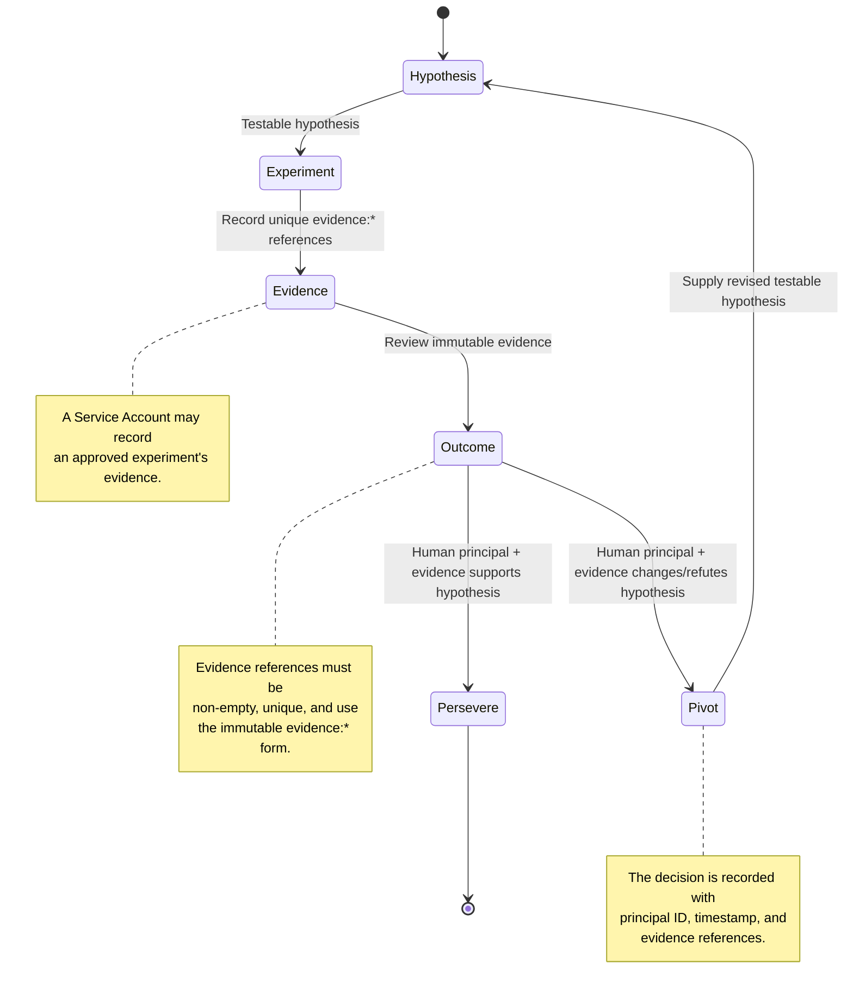
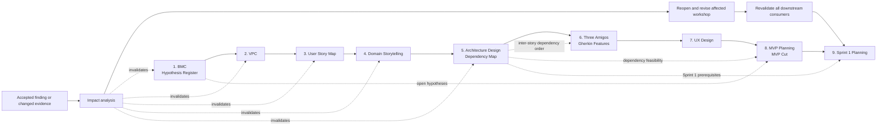

# Lean-Agile MVP Workflows

**Source:** Phase 04 — Lean-Agile MVP Workflow Completion

The Portfolio-owned Lean-Agile MVP extension is a versioned workflow layered on the public,
generic Workflow Engine contract. It requires a testable hypothesis, unique immutable evidence
references, and a human principal for every pivot-or-persevere decision.

## Workshop orchestration and feedback propagation

The state machine above is the **implemented Phase 04, initiative-level evidence loop**. It is not
yet a workflow for the Lean-Agile MVP workshop sequence. The latter should be added as a separate,
Portfolio-owned orchestration extension: each workshop run produces a versioned artifact, declares
what it consumed, and participates in dependency and change-impact tracking.

### Dependency rules

- Workshops 1 through 9 run in order, but the records form a directed artifact graph rather than a
  one-way checklist. Every workshop must record the exact artifact versions it consumed and the
  version it produced.
- Workshop 5 owns the **inter-story dependency map**. It orders implementation according to shared
  aggregates, domain-event producer/consumer order, and infrastructure prerequisites; Workshop 6,
  Workshop 8, and Workshop 9 consume that map rather than independently inventing sequence.
- Workshop 8 must check the MVP cut against Workshop 1's open Hypothesis Register. A cut that
  removes the only validation path for an open hypothesis is a blocking finding, not a silent
  deferral.
- A later workshop can invalidate an upstream artifact. The workflow must record the finding,
  affected artifact version, reason, and owning workshop; reopen the affected workshop; then
  revalidate every downstream artifact before resuming the sequence.
- Reopening is normal controlled feedback, not failure. Superseded artifacts remain immutable audit
  evidence; revised artifacts become new versions linked by `supersedes` and `invalidates` edges.

### Recommended workflow boundary

Model workshops as child workflows of an initiative's Lean-Agile MVP workflow, not as additional
states in the hypothesis state machine. A future `portfolio.lean-agile-mvp-workshops` extension
should carry `WorkshopRun`, `ArtifactVersion`, `ArtifactDependency`, and `ImpactAssessment`
records. It should publish the resulting evidence references into the existing Phase 04 workflow,
where a human principal remains responsible for the pivot-or-persevere decision.

## Invariants

- Only the declared transitions are valid; `persevere` is terminal.
- Evidence, outcome, pivot, and persevere gates require one or more unique `evidence:*` references.
- A Service Account can record evidence but cannot make a pivot-or-persevere decision.
- A pivot must return to hypothesis with a revised, non-empty hypothesis.
- The read-only projection exposes the current state, available next states, evidence references,
  and the most recent decision for later activity-feed consumers.
- Workshop orchestration is a follow-on extension; it is documented here as the required design,
  not represented in the Phase 04 implementation yet.

## Public-contract recording

Each accepted transition is recorded through the versioned public
`workflow extension transition` command using extension identifier `portfolio.lean-agile-mvp` and
schema version `1.0.0`. The generic engine persists the transition as immutable audit evidence;
Portfolio retains ownership of the Lean-Agile MVP rules and projection.

## References

- [Phase 04 checklist](phases/04-lean-agile-mvp-workflow-completion/checklist.md)
- [Phase 04 summary](phases/04-lean-agile-mvp-workflow-completion/summary.md)
- [Lean-Agile MVP workflow implementation](../../../../libs/lean-agile-mvp-workflow/src/lib/lean-agile-mvp-workflow.ts)
