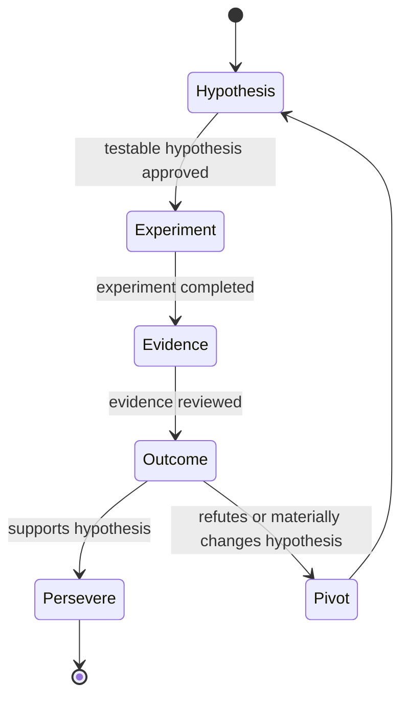

# Phase 00 — Agreed Contract Decisions

> ⚠️ **Repointed 2026-09-08.** This is a **completed phase record**. Every *Singularity* reference in
> it was rewritten to *LeanAgileOS* by the upstream repoint
> ([ADR-002](../../../../../architecture/adr-002-lean-agile-os-is-the-upstream-platform.md)); the work it
> describes was carried out when the upstream was `singularity`. Package names in code
> (`@singularity/*`) were deliberately **not** renamed — ADR-002 §4.

> **Ownership moved:** The reusable Lean-Agile MVP package, generic specifications, and the
> canonical historical copy of this document now live in [LeanAgileOS Phase 21](https://github.com/dave-jackson-dev/lean-agile-os/blob/dev/docs/planning/lean-agile-os/features/resumable-workflow-steps/phases/21-live-product-pilot-and-extraction-decision/evidence/portfolio-lean-agile-mvp-foundation/phases/00-charter-contract-freeze/decisions.md).
> This Portfolio copy remains as a consumer-side forwarding and integration record.

**Date:** 2026-08-19

## 1. Identity-aware events

Portfolio will consume `PlatformEventEnvelope` v2 for new identity-aware events. Version 1 remains
unchanged for existing consumers. Version 2 has a mandatory discriminated `actor`, a distinct
producing `source`, and optional explicit `delegation` for on-behalf-of work. `principalId` is used
only for the `principal` actor kind; a Service Account uses `serviceAccountId` and is never
represented as a principal merely for convenience.

The initial Portfolio Activity Feed consumes only allowlisted authenticated activity with an
explicit projection mapping to one `audiencePrincipalId`. Anonymous activity and service-only
operations are retained for audit/operations as appropriate but are not shown in the personal
feed. Impersonation is schema-reserved and deferred from the first Portfolio release.

## 2. Public adapter and versioning

The first consumer boundary is a versioned programmatic Workflow Engine module/factory. Portfolio
uses its documented commands, queries, and result/error envelopes through a thin adapter. An HTTP
adapter is deferred and must preserve the same contract. JSON Schema is the reviewable source of
truth for interoperable artifacts. Additive v1 changes are backward compatible; breaking changes
require a new major contract version and a migration window.

## 3. Macro-recording model

`MacroRecording` is append-only evidence assembled from allowlisted, redacted events. It is not an
executable workflow. `WorkflowMacro` is a separately created, immutable, versioned command recipe
that contains explicit input bindings, branch/compensation policy, approval metadata, and only
references to evidence. A human approves every macro version. Replay dispatches commands into a
disposable workspace and never re-emits recorded history.

The initial records retain correlation and causation identifiers, event identity/type/version,
organization scope, actor classification, redaction outcome, and retention classification. They
exclude credentials, provider keys, cookies/tokens, prompts, private knowledge, agent/skill
artifacts, raw personal data, and arbitrary event payloads.

### Initial event allowlist and redaction table

| Event type | Recorder fields permitted | Explicitly removed/rejected |
| --- | --- | --- |
| `workflow.step.started` / `workflow.step.completed` / `workflow.step.blocked` / `workflow.step.resumed` | workflow, step, correlation, actor classification, timestamp, status, evidence reference | command input, free-text evidence, tokens, request metadata |
| `workflow.mvp.evidence-recorded` | workflow, hypothesis/experiment reference, evidence hash/reference, timestamp | raw evidence body, uploaded content, prompts, personal data |
| `workflow.macro.approved` | macro ID/version, approver principal ID, timestamp, evidence-recording references | approval comment body, credentials, arbitrary payload |
| `workflow.macro.replay-completed` | macro ID/version, disposable-workspace ID, outcome/status, timestamp | workspace contents, command input values, historical events |

Every other event type is rejected by the Portfolio recorder until a contract change adds its
row. Redaction happens before PouchDB persistence. A rejected event may increment a non-sensitive
operational counter but must not persist its payload.

## 4. Lean-Agile MVP extension

The project-neutral Lean-Agile MVP extension uses the following states:

Each transition requires a workflow ID, correlation ID, actor/service attribution, and immutable
evidence reference. Only an authorized human principal may record the pivot-or-persevere decision;
a Service Account may execute an approved experiment but cannot make that decision.

## 5. PouchDB runtime security

PouchDB is the authoritative local workflow/audit store. It runs on encrypted-at-rest runtime
storage outside the Docker image. Encryption keys are supplied at runtime through the deployment
secret mechanism, rotated independently of image releases, and never stored in PouchDB fixtures,
source control, images, logs, or telemetry. Images may contain only public baselines and sanitized
fixtures. Backup/restore uses encrypted artifacts and verifies an integrity manifest before restore.

## 6. Cross-repository integration

LeanAgileOS owns public Workflow Engine schemas, compatibility policy, and provider contract tests.
Portfolio owns its thin adapter and consumer tests. The independently versioned Lean-Agile MVP
package owns the methodology extension and projection mapping.
A shared sanitized fixture set proves command/result compatibility, v2 event validation, redaction,
idempotency, and actor/organization isolation. Contract changes require paired PRs, with the
provider PR merged first and the consumer PR pinned to the accepted version. The compatibility
window supports the current and immediately preceding compatible minor version.

## Remaining implementation work

These are decisions, not a declaration that the runtime adapter is complete. Phase 00 still needs
the concrete macro schemas, event allowlist/redaction table, Cucumber scenarios, and a contract
fixture test before its exit gate can pass.
