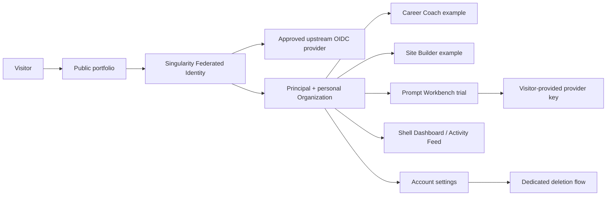

# Interactive Examples — Proposed Scope

**Status:** Draft for ratification  
**Date:** 2026-08-18  
**Applies to:** Portfolio at `portfolio.davejackson.dev`

## Purpose

Portfolio will include small, running examples of selected products. They are not product trials in
the commercial sense and must not become an unbounded hosted SaaS surface. Their purpose is to let
a visitor experience a narrow, complete workflow after signing in, while evidencing product,
security, and platform engineering decisions.

## Tenancy model

Singularity's platform IAM model already provisions a **personal Organization** for every
authenticated Principal and assigns that `organizationId` back to the Principal. An Individual is
therefore an Organization of One; a future team is an Organization with additional members.

Provided Portfolio adopts this IAM boundary, every interactive-example record, AI-router request,
quota, and deletion workflow is scoped by `organizationId`. Portfolio must not introduce a second,
parallel tenant identifier or map a visitor to an invented Portfolio-only organization.

**Proposed direction:** add **Federated Identity** to Singularity IAM. IAM remains the issuer
trusted by Portfolio and other products, while its Federated Identity capability delegates initial
authentication to approved upstream OIDC providers. The initial provider set and
production/development tenant configuration remain implementation decisions.

## Scope decisions

### Included

| Capability                | V1 scope                                                                                                                                                                         | Explicit boundary                                                                                                 |
| ------------------------- | -------------------------------------------------------------------------------------------------------------------------------------------------------------------------------- | ----------------------------------------------------------------------------------------------------------------- |
| Federated sign-up/sign-in | Portfolio redirects to Singularity IAM, which brokers approved upstream OIDC providers using Authorization Code + PKCE.                                                          | Portfolio does not own passwords, email delivery, federation credentials, or verification workflows.              |
| Account profile           | Portfolio uses the IAM Principal and its auto-provisioned personal Organization as the account and ownership boundary. A verified email is profile data, never the identity key. | No provider-specific account assumptions, Portfolio-only tenant IDs, or email-only account linking.               |
| Career Coach example      | A signed-in visitor can complete one focused coaching session and see a generated, editable action plan.                                                                         | No CV/file upload, job-board integration, background jobs, or persistent coaching history in V1.                  |
| Site Builder example      | A signed-in visitor can create and preview one disposable one-page site from structured inputs. It does not use server-side AI.                                                  | No custom domains, publication, asset uploads, collaborative editing, long-lived hosted sites, or server-side AI. |
| Prompt Workbench trial    | A signed-in visitor can execute a bounded prompt experiment using their own OpenAI or Anthropic API key.                                                                         | No key storage, conversation history, retrieval corpus, extensions, agents, or arbitrary provider endpoints.      |
| Account deletion          | Account settings offers a dedicated deletion flow. It revokes access immediately and schedules deletion of user-owned example data.                                              | Deletion is not offered from the normal sign-out flow.                                                            |

### Deferred

- Full Career Coach, Site Builder, or Prompt Workbench product features.
- Singularity agents, skills, prompts, system instructions, model configurations, private
  knowledge, and agent execution history.
- Password-based authentication and local email verification.
- Organization/team accounts, shared workspaces, billing, subscriptions, and entitlement management.
- File upload, user-generated public content, custom domains, background processing, and webhook-driven integrations.
- Arbitrary AI-provider base URLs or model IDs.
- Shared-platform extraction or package publication. Portfolio first proves a real second-consumer need.

## Experience model

Public project, profile, and case-study pages remain anonymous. Authentication gates only the
interactive examples and account settings.

## Shell experience

The Portfolio Shell is the composition root for the interactive examples. It provides shared
navigation and live activity visibility; individual example applications do not reimplement that
chrome.

| Shell area    | V1 behavior                                                                                                                                        | Reference and boundary                                                                                                                                     |
| ------------- | -------------------------------------------------------------------------------------------------------------------------------------------------- | ---------------------------------------------------------------------------------------------------------------------------------------------------------- |
| Header        | A Theme selector controls color scheme, palette, and font for the whole Shell.                                                                     | Model the selector's behavior and accessibility contract on `apps/blog`'s `lib-theme-menu`; the blog is not a Shell-contained application.                 |
| Left sidebar  | A closed-by-default, expandable NavMenu acts as an app switcher for Career Coach, Site Builder, Prompt Workbench, Dashboard, and account settings. | Model its lifecycle, responsive behavior, and accessibility on the Platform Portal Shell's left `ejs-sidebar`. It is Shell chrome, not a remote-owned nav. |
| Right sidebar | A Shell-level Dashboard/Activity Feed view opens alongside the active example.                                                                     | It is a dedicated Dashboard UI remote or feature, loaded by the Shell, rather than an embedded view owned by an example app.                               |

### Dashboard and Activity Feed

The Dashboard/Activity Feed makes the DDD infrastructure observable while a visitor exercises an
example application. It is not an operations console and must never expose platform-wide telemetry.

- Show a purpose-built, allowlisted activity projection: user-initiated commands, completed
  workflows, and resulting domain/integration events. Do not stream raw logs, traces, request
  bodies, prompts, API keys, stack traces, or other visitors' data.
- Query and subscribe with both the authenticated `principalId` and `organizationId`. The backend
  derives both values from the validated token; it never accepts either as a browser-supplied scope.
  `organizationId` supports the Organization-of-One model, while `principalId` preserves the
  requirement that the feed show **only the current user's** activity if a future organization has
  multiple members.
- Deliver updates over an authenticated gateway SSE endpoint. The subscription is revoked when the
  session ends, and the server filters every event before it enters the connection.
- Retain a small, documented per-user window suitable for demonstration. The dashboard is not a
  general telemetry archive.
- Reuse Singularity's event/telemetry infrastructure through a thin adapter and an explicit
  Portfolio-facing read contract; do not let the browser query the event store or observability
  backend directly.

## Workflow Engine and macro recording

The detailed multi-phase delivery plan is
[Workflow Engine and Lean-Agile MVP Foundation](features/workflow-engine-lean-agile-mvp-foundation.feature.md).

Portfolio uses the Singularity Workflow Engine through a thin adapter. The engine kernel remains
generic: its lifecycle, transitions, persistence contracts, and replay rules must not import
Portfolio, Lean-Agile MVP, agents, skills, or other product-specific concerns.

### Lean-Agile MVP extension

Portfolio supplies a Lean-Agile MVP workflow extension to the engine: workflow definitions,
schemas, validation rules, projections, and presentation labels for the methodology. This is how
the engine is customized for the methodology without turning the reusable kernel into a
methodology-specific application.

The extension makes its gates explicit and observable: hypothesis, experiment, evidence, outcome,
and the resulting pivot/persevere decision. It may use the engine's commands, queries, events,
snapshots, and projections, but it must not rely on an agent or skill to make an opaque state
transition.

**Delivery rule:** the Portfolio Lean-Agile MVP extension is the workflow for all subsequent
Portfolio work. Federated Identity, account deletion, Shell/Dashboard, Site Builder, Career Coach,
Prompt Workbench, deployment, and documentation are each initiated, gated, evidenced, and handed
off through versioned extension workflow definitions. No later implementation deliverable starts
until the extension's baseline lifecycle and evidence rules are running.

### PouchDB macro-recording spike

The spike determines whether a Portfolio workflow recorder can subscribe to allowlisted domain
events and build a reviewable workflow macro. A domain-event sequence is evidence of what happened;
it is not, on its own, a safe executable macro. A macro must also record explicit intent,
parameters, branching/compensation policy, and a human approval before it becomes reusable.

| Concern            | Required design                                                                                                                                                                                           |
| ------------------ | --------------------------------------------------------------------------------------------------------------------------------------------------------------------------------------------------------- |
| Event subscription | Consume only versioned `PlatformEventEnvelope` messages through the approved cross-service transport. Do not read another service's database or rely on an in-process EventBus across service boundaries. |
| Recording          | Persist an idempotent, append-only PouchDB recording keyed by `eventId`, with `organizationId`, `principalId`, `correlationId`, type, version, and redacted payload projection.                           |
| Macro creation     | Group ordered recordings by correlation and workflow session, then require a user review/approval command to create an immutable, versioned PouchDB macro definition.                                     |
| Replay             | Replay against a disposable workspace using commands and explicit input bindings—not by re-emitting historical domain events. The original events remain immutable audit evidence.                        |
| Safety             | Allowlist event types and payload fields; redact secrets, tokens, prompts, provider keys, personal content, and raw telemetry before recording.                                                           |

PouchDB remains the authoritative local store for workflow state, event recordings, macro
definitions, and audit evidence. Its changes feed drives the Dashboard/Activity Feed projection;
the browser continues to consume only the authenticated, filtered gateway SSE stream.

### Container and encryption boundary

An image may contain only a versioned, public PouchDB baseline or sanitized macro fixture. It must
never contain live visitor data, decrypted recordings, provider keys, or encryption material.
Runtime PouchDB state belongs on an encrypted mounted volume or managed store outside the immutable
image. Encryption keys are injected at runtime from an approved secret source; putting both a
database and its key in the same Docker image provides no meaningful protection.

### Proprietary boundary

Portfolio must not contain, package, import, deploy, or expose Singularity's proprietary agents,
skills, prompts, system instructions, model configurations, private knowledge, or agent execution
history. The permitted integration surface is limited to public workflow and event contracts plus
sanitized, Portfolio-owned Lean-Agile MVP definitions and projections.

## Identity and account lifecycle

### Federated authentication

- Portfolio uses OIDC Authorization Code flow with PKCE against Singularity IAM. IAM brokers the
  approved upstream OIDC providers and issues the tokens trusted by Portfolio services.
- Resolve the authenticated Principal and `organizationId` from the validated token; do not key
  accounts by email.
- IAM links an upstream identity to a Principal only by immutable `(upstream issuer, subject)`.
  Never auto-link based solely on matching email claims.
- Require an asserted, verified email only if a chosen provider and the product action genuinely
  need it. The initial interactive examples do not require email as a business field.
- Account linking is an explicit, re-authenticated user action. Never link accounts merely because
  email strings match.
- The gateway validates short-lived signed access tokens using cached issuer signing keys. Services
  receive only the verified principal context on the internal network.

### Sign-out and deletion

| Action            | User result                                                                 | System result                                                                                |
| ----------------- | --------------------------------------------------------------------------- | -------------------------------------------------------------------------------------------- |
| Sign out          | Ends the current session.                                                   | Clear/revoke the relevant session; retain the account and example data.                      |
| Request deletion  | Requires recent re-authentication and a clear confirmation of consequences. | Immediately revoke access, record a deletion request, and begin user-data deletion.          |
| Withdrawal window | User may cancel the request during a stated grace period.                   | Data is unavailable while pending deletion; deletion is irreversible after the grace period. |
| Completion        | Account and user-owned example data are removed.                            | Retain only the minimum security/audit record justified by a documented retention policy.    |

The deletion grace period is **one week**. The retention policy remains an open decision and must
be stated in the UI and implemented consistently before account deletion ships.

## Prompt Workbench BYOK boundary

The trial's initial, reviewed provider allowlist is **OpenAI and Anthropic (Claude)**. "Provider of
the visitor's choice" means a choice among these explicitly supported adapters; it does not mean
arbitrary URLs, models, or OpenAI-compatible endpoints.

### Non-negotiable controls

- Never persist the raw API key in Portfolio data stores.
- Never include it in logs, tracing, analytics, error reports, browser storage, URLs, or test
  fixtures.
- Display the provider, model, and charge responsibility before execution.
- Limit prompt and output sizes, requests per session, and concurrent executions.
- Keep the key in memory only for the current session unless a later, explicitly approved security
  design changes this.
- Treat any server-side proxy as sensitive infrastructure: redact request bodies, prohibit request
  capture, and forward only to allowlisted provider hosts.

### Required spike

Before committing to a provider implementation, spike one provider end to end and determine:

1. whether browser-to-provider calls are supported and safe for the intended flow;
2. whether a gateway proxy is needed for CORS or provider compatibility;
3. what request/response data can be logged safely; and
4. how the supported-provider adapter contract rejects unsupported targets.

The first provider is an implementation decision, not a promise in the public UI.

## Architecture impact

This scope supersedes the earlier proposal that Identity serve Admin only. Identity now has two
principal classes:

- **Portfolio visitor** — a public user who signs in solely to use an interactive example and
  manage their account.
- **Administrator** — an author/operator with access to the Admin remote and operational actions.

Authorization must distinguish these roles and scope every example record to the visitor's
`organizationId`. The examples must use per-user disposable workspaces/sessions, with
server-enforced ownership checks on every read and mutation.

The Portfolio gateway remains a read-composition root for public pages. It must not orchestrate
cross-context example writes. Each example owns its transaction; integration effects require the
integration-event/outbox decision already identified in the architecture review. Running examples
and the Dashboard use thin adapters to Singularity capabilities rather than copied product or
platform implementations.

## Delivery sequence

1. **Workflow Engine and Lean-Agile MVP foundation:** Portfolio thin adapter, Lean-Agile MVP
   extension contract, baseline lifecycle/evidence rules, event subscription adapter, redacted
   PouchDB recording, macro approval, disposable replay, encrypted runtime-store proof, and
   end-to-end evidence.
2. **Federated Identity foundation:** upstream-provider spike, federated-identity mapping,
   personal-organization provisioning, session/token validation, authorization middleware,
   sign-out, and account settings shell—executed through the MVP extension.
3. **Deletion lifecycle:** deletion request, access revocation, one-week grace-period handling,
   data purge, audit/retention policy, and end-to-end acceptance scenarios—executed through the
   MVP extension.
4. **Shell and Dashboard foundation:** theme selector, left app-switcher sidebar, authenticated
   right activity sidebar, per-principal event projection, and gateway SSE subscription—executed
   through the MVP extension.
5. **Site Builder vertical slice:** one signed-in disposable preview with the same lifecycle and
   ownership guarantees, without server-side AI.
6. **Career Coach vertical slice:** one signed-in session, one bounded generated action plan,
   ownership checks, rate limits, and a complete Cucumber/Screenplay journey.
7. **Prompt Workbench BYOK spike and slice:** OpenAI and Anthropic adapters, no-persistence proof,
   redaction tests, usage limits, disclosure UI, and a complete journey using a test provider
   adapter.

Each example ships only when its deletion path, ownership checks, rate limit, and end-to-end test
are green. Adding an example is not an excuse to defer these controls.

## Acceptance criteria for the scope

- A visitor can sign in without Portfolio handling a password or sending verification email.
- The same authenticated Principal consistently resolves to its personal Organization and
  `organizationId`.
- A visitor cannot read, alter, or delete another visitor's example data.
- Sign-out does not delete data.
- Account deletion requires re-authentication, revokes access, and deletes example data according
  to the published lifecycle.
- A raw BYOK value cannot be recovered from application data, logs, telemetry, browser storage, or
  test fixtures.
- Each live example has a green end-to-end Cucumber/Screenplay scenario.

## Decisions still required

1. Define the Google and Microsoft upstream OIDC production/development tenant strategy.
2. Set the defensible data-retention policy after the one-week deletion grace period ends.
3. **Resolved:** Site Builder ships before Career Coach after the Shell/Dashboard foundation.
4. Define the Portfolio-facing thin-adapter contracts for each Singularity capability, including
   the activity-feed projection and SSE contract.
5. Define the allowed domain-event types and redacted payload fields for the PouchDB
   macro-recording spike.
6. Define the encrypted PouchDB runtime-store and key-management approach before any visitor data
   is persisted in a containerized deployment.
